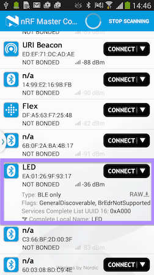
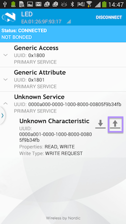
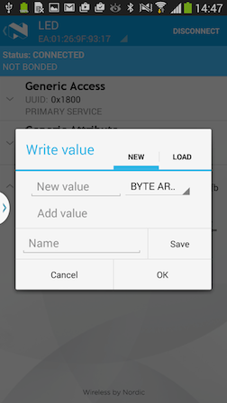

#Creating an Actuator Service

With mbed BLE, we offer a growing set of SIG-defined BLE services implemented as C++ headers to ease application development. These can be found under [our services repository](https://github.com/mbedmicro/BLE_API/tree/master/services).

But, we don’t expect you to settle for what’s already been done; we expect you to develop applications for custom sensors and actuators,. These will often fall outside the scope of the standard Bluetooth services or the service templates offered by mbed BLE. In this case, you could use the ``BLE_API``. You may also find that you benefit from modelling your custom services as C++ classes for ease of use (and reuse). Here, we'd like to capture the process of creating a BLE service.

In the [previous sample](../AdvSamples/InputButton.md) we went over the process of setting up a custom BLE service encapsulating a read-only characteristic. In this example, we'd like to review the creation of a service with a read-write characteristic. Together, these will form the basis of most BLE services.

#LED Service

Let's create a service for a trivial actuator: an LED. We'll assume a use-case where a phone app would like to connect to this mbed application and set the LED state. In the non-connected state, the application simply advertises its ability to provide an LED service.

<span style="background-color:#E6E6E6; border:1px solid #000;display:block; height:100%; padding:10px">
Get the code [here](https://developer.mbed.org/teams/Bluetooth-Low-Energy/code/BLE_LED/).
</span>

##The Basic Template - Advertising and Connecting

Here's a template to get you started with the very basics. We've thrown in a blinking LED to indicate program stability.

This code doesn't create a custom service. It advertises LED as the device name through the advertisement payload. The application is discoverable (``LE_GENERAL_DISCOVERABLE``) and connectable (``ADV_CONNECTABLE_UNDIRECTED``), and offers only the standard GAP and GATT services. The function  ``disconnectionCallback`` re-starts advertisements if the connection is lost.

```c
	
	#include "mbed.h"
	#include "BLEDevice.h"

	/* Instantiation of a BLEDevice in
	* global scope allows us to refer to
	* it anywhere in the program. */
	BLEDevice   ble;            	


	/* helper LED to indicate system aliveness. */
	DigitalOut  alivenessLED(LED1); 

	* setting up a device name helps with identifying
	* your device; this is often very useful when
	* there are several other BLE devices in the
	* neighborhood. */
	const static char DEVICE_NAME[] = "LED"; 

	void disconnectionCallback(Gap::Handle_t handle, Gap::DisconnectionReason_t reason)
	{	
		* You need to explicitly re-enable
		* advertisements after a connection
		* teardown. */
		ble.startAdvertising();  /	
	}

	void periodicCallback(void)
	{
		/* Do blinky on LED1 to indicate system aliveness. */
		alivenessLED = !alivenessLED; 
	}

	int main(void)
	{
		/* aliveness LED starts out with being off; doesn't really
		* matter too much because we only toggle it. */
		alivenessLED = 0;                							
		/* A mechanism for periodic callbacks. */			
		Ticker ticker;                   	
		/* Setting up a callback to go at an interval of 1s. */
		ticker.attach(periodicCallback, 1);	

		/*  initialize the BLE stack and controller. */
		ble.init();                      	
		ble.onDisconnection(disconnectionCallback);

		/* setup advertising */
	
		/* BREDR_NOT_SUPPORTED means classic bluetooth not supported;
 		* LE_GENERAL_DISCOVERABLE means that this peripheral can be
 		* discovered by any BLE scanner--i.e. any phone. */
		ble.accumulateAdvertisingPayload(GapAdvertisingData::
			BREDR_NOT_SUPPORTED | GapAdvertisingData::
			LE_GENERAL_DISCOVERABLE);

		/* This is where we're collecting the device 
		* name into the advertisement payload. */
		ble.accumulateAdvertisingPayload(GapAdvertisingData::
			COMPLETE_LOCAL_NAME, 
			(uint8_t *)DEVICE_NAME, sizeof(DEVICE_NAME));

		/* We'd like for this BLE peripheral to be connectable. */
		ble.setAdvertisingType(GapAdvertisingParams::ADV_CONNECTABLE_UNDIRECTED);

		/* set the interval at which advertisements are sent out; this has
 		* an implication power consumption--radio activity being a
 		* biggest draw on average power. The other software controllable
 		* parameter which influences power is the radio TX power
 		* level--there is an API to adjust that. */
		
		/* 1000ms. */
		ble.setAdvertisingInterval(1000);

		/* we're finally good to go with advertisements. */
		ble.startAdvertising();

		while (true) {
			ble.waitForEvent();
		}
	}
```

This is what the app looks like (on the nRF Master Control Panel):

<span style="text-align:center; display:block;">

</span>

##Assigning UUIDs

Now, let's get down to the business of creating a BLE service for an LED. This service will have a single write-only characteristic, which will hold a boolean value for the LED’s state.

Bluetooth Smart requires the use of UUIDs to identify types for all involved entities. We'll need two UUIDs - one each - for the LED service and the encapsulated characteristic. If we had been creating one of the standard SIG defined services, we'd have followed the standard [UUID definitions](https://developer.bluetooth.org/gatt/services/Pages/ServicesHome.aspx).

We've chosen a custom UUID space for our LED service: 0xA000 for the service, and 0xA001 for the contained characteristic. This avoids collision with the standard UUIDs.

```c

	#define LED_SERVICE_UUID              0xA000
	#define LED_STATE_CHARACTERISTIC_UUID 0xA001
	
	[...]
	
	static const uint16_t uuid16_list[] = {LED_SERVICE_UUID};
	
	[...]

	ble.accumulateAdvertisingPayload(GapAdvertisingData::
		COMPLETE_LIST_16BIT_SERVICE_IDS, 
		(uint8_t *)uuid16_list, sizeof(uuid16_list));
```

Adding the LED service UUID to the advertising payload is purely optional. But having it is good practice, since it gives interested client apps an early and cheap indication of the mbed application's capabilities. 

<span style="background-color:#E6E6E6; border:1px solid #000;display:block; height:100%; padding:10px">
**Note:** interpreting non-standard UUID has limited use, and may only work with custom phone apps.
</span>

##The LED State Characteristic

``BLE_API`` offers C++ abstractions for entities involved in service definition. A ``GattService`` class contains one or more ``GattCharacteristics``. The ``GattCharacteristics`` represents state variables exposed by the service. Every ``GattCharacteristic`` implicitly contains at least one ``GattAttribute`` to hold the value. It may be have more than one``GattAttribute``, but that is uncommon.

So the application needs to set up one or more ``GattCharacteristics`` and compose them into a ``GattService``. There could be more than one service.

In C++, class objects are instantiated when variables are defined in some scope, or when they’re allocated dynamically using ``new()``. We usually avoid dynamic allocation, but in all cases we need to take care of scope and aliveness of variables. We can define the button state characteristic wherever memory allocations remain persistent throughout the application’s lifetime, for example ``main()``. 

The code only looks complicated; it is in reality a simple use of C++ templates to instantiate a write-only characteristic encapsulating a boolean state. The constructor for ``ledState`` takes in the UUID and a pointer to the initial value of the characteristic:

```c

	bool initialValueForLEDCharacteristic = false;
	WriteOnlyGattCharacteristic<bool> 
		ledState(LED_STATE_CHARACTERISTIC_UUID, 
		&initialValueForLEDCharacteristic);
```

<span style="background-color:#E6E6E6; border:1px solid #000;display:block; height:100%; padding:10px">
**Tip:** there are several variants of ``GattCharacterisitc`` available to ease instantiation. Refer to template declarations at the bottom of [GattCharacteristic.h](https://github.com/mbedmicro/BLE_API/blob/master/public/GattCharacteristic.h).
</span>

We can make ``ledState`` readable by using ``ReadWriteGattCharacterisitc<T>``. This will allow a phone app to connect and probe the ``ledState``:

```c

	bool initialValueForLEDCharacteristic = false;
	ReadWriteGattCharacteristic<bool> 
		ledState(LED_STATE_CHARACTERISTIC_UUID, 
		&initialValueForLEDCharacteristic);
```

##Constructing the LED Service

We can use the ``ledState`` characteristic to construct a GATT service called ``ledService``. We use a bit of C/C++ syntax to create a one-element array, using an initialiser list of pointers to ``GattCharacteristics``. 

We can then add this service to the BLE stack using ``BLEDevice::addService()``:

```c

	GattCharacteristic *charTable[] = {&ledState};
	GattService         ledService(LED_SERVICE_UUID, 
		charTable, sizeof(charTable) / sizeof(GattCharacteristic *));
	ble.addService(ledService);
```

##Putting it Together

We now have a custom LED service containing a characteristic that is both readable and writable:

```c

	#include "mbed.h"
	#include "BLEDevice.h"
	
	BLEDevice   ble;
	DigitalOut  alivenessLED(LED1);

	/* Define custom UUIDs which won't conflict with
	* any of the SIG standard services/characteristics. */

	#define LED_SERVICE_UUID          	0xA000
	#define LED_STATE_CHARACTERISTIC_UUID 0xA001

	const static char 	DEVICE_NAME[] = "LED";
	static const uint16_t uuid16_list[] = {LED_SERVICE_UUID};

	void disconnectionCallback(Gap::Handle_t handle, 
		Gap::DisconnectionReason_t reason)
	{
		ble.startAdvertising();
	}

	void periodicCallback(void)
	{
		/* Do blinky on LED1 to indicate system aliveness. */
		alivenessLED = !alivenessLED; 
	}
	
	int main(void)
		{
		alivenessLED = 0;
		Ticker ticker;
		ticker.attach(periodicCallback, 1);

		ble.init();
		ble.onDisconnection(disconnectionCallback);

		/*
		* The part which sets up the characteristic and service. Objects
		* are instantiated within the scope of main(), but then this
		* isn't a problem since main() remains alive as long as the
		* application runs.
		*/

		bool initialValueForLEDCharacteristic = false;
		ReadWriteGattCharacteristic<bool> 
			ledState(LED_STATE_CHARACTERISTIC_UUID, 
					&initialValueForLEDCharacteristic);

		GattCharacteristic *charTable[] = {&ledState};
		GattService     	ledService(LED_SERVICE_UUID, 
			charTable, sizeof(charTable) / sizeof(GattCharacteristic *));
		ble.addService(ledService);

		/* setup advertising */
		ble.accumulateAdvertisingPayload(GapAdvertisingData::
			BREDR_NOT_SUPPORTED | GapAdvertisingData::
			LE_GENERAL_DISCOVERABLE);
	
		/* We've added this bit for advertising the service UUID to save
		* applications from having to connect for service discovery. */

		ble.accumulateAdvertisingPayload(GapAdvertisingData::
			COMPLETE_LIST_16BIT_SERVICE_IDS, 
			(uint8_t *)uuid16_list, sizeof(uuid16_list));

		ble.accumulateAdvertisingPayload(GapAdvertisingData::
			COMPLETE_LOCAL_NAME, 
			(uint8_t *)DEVICE_NAME, sizeof(DEVICE_NAME));
		ble.setAdvertisingType(GapAdvertisingParams::
			ADV_CONNECTABLE_UNDIRECTED);
		/* 1000ms. */
		ble.setAdvertisingInterval(1000);
		ble.startAdvertising();

		while (true) {
			ble.waitForEvent();
		}
	}
```

##Controlling the LED

So far, the ``ledState`` characteristic within the service had no binding to a physical LED. If a user wrote to this characteristic from a phone app, it would not actuate anything in the application.

We can introduce a real LED with the following:

```c
	
	DigitalOut  actuatedLed(LED2);
```

We can now add some code to respond when the client writes to the ``ledState`` characteristic and update the physical LED. ``BLE_API`` provides an ``onDataWritten`` callback, which we can set to an application-specific handler.

The following code sets up callbacks for when the phone app attempts to write to the ``ledState`` characteristic of the ``LEDService``:

```c

	DigitalOut  actuatedLed(LED2);
	[...]
	
	/**
	* This callback allows the LEDService to receive updates to the
	*  ledState Characteristic.
	* @param[in] params
	*  Information about the characterisitc being updated.
	*/
	void onDataWrittenCallback(const GattCharacteristicWriteCBParams *params) {
		if (params->charHandle == ledState.getValueHandle()) {
			/* Do something here to the actuated LED based on the received params. */
		}
	}

	int main(void)
	{
	[...]
	ble.onDataWritten(onDataWrittenCallback);
```

Note that within the ``onDataWritten`` callback, we can identify the characteristic being updated using a value handle. The declaration of the ``ledState`` characteristic needs to be moved into a global context in order for the ``onDataWritten`` callback to access it. Here's the full code:

```c

	#include "mbed.h"
	#include "BLEDevice.h"

	BLEDevice   ble;
	DigitalOut  alivenessLED(LED1);
	DigitalOut  actuatedLED(LED2);

	#define LED_SERVICE_UUID              0xA000
	#define LED_STATE_CHARACTERISTIC_UUID 0xA001
	
	const static char     DEVICE_NAME[] = "LED";
	static const uint16_t uuid16_list[] = {LED_SERVICE_UUID};

	bool initialValueForLEDCharacteristic = false;
	ReadWriteGattCharacteristic<bool> 
		ledState(LED_STATE_CHARACTERISTIC_UUID, 
		&initialValueForLEDCharacteristic);

	void disconnectionCallback(Gap::Handle_t handle, 
		Gap::DisconnectionReason_t reason)
	{
		ble.startAdvertising();
	}

	void periodicCallback(void)
	{
		/* Do blinky on LED1 to indicate system aliveness. */
		alivenessLED = !alivenessLED; 
	}

	/**
	* This callback allows the LEDService to receive
	* updates to the ledState Characteristic.
	* @param[in] params
	* Information about the characterisitc being updated.
	*/

	void onDataWrittenCallback(const GattCharacteristicWriteCBParams *params) {
		if ((params->charHandle == ledState.getValueHandle()) && 
			(params->len == 1)) {
		actuatedLED = *(params->data); 
		/* we interpret the 1-byte data
		* received from the
		* callbackParams as a value to
		* be written to the
		* LED. Writing anything
		* non-zero will turn on the
		* LED; otherwise it will be
		* reset to off */
		}
	}

	int main(void)
	{
		alivenessLED = 0;
		actuatedLED  = 0;
	
		Ticker ticker;
		ticker.attach(periodicCallback, 1);

		ble.init();
		ble.onDisconnection(disconnectionCallback);
		ble.onDataWritten(onDataWrittenCallback);

		GattCharacteristic *charTable[] = {&ledState};
		GattService         ledService(LED_SERVICE_UUID, 
			charTable, sizeof(charTable) / sizeof(GattCharacteristic *));
		ble.addService(ledService);

		/* setup advertising */
		ble.accumulateAdvertisingPayload(GapAdvertisingData::
			BREDR_NOT_SUPPORTED | GapAdvertisingData::
			LE_GENERAL_DISCOVERABLE);
		ble.accumulateAdvertisingPayload(GapAdvertisingData::
			COMPLETE_LIST_16BIT_SERVICE_IDS, 
			(uint8_t *)uuid16_list, sizeof(uuid16_list));
		ble.accumulateAdvertisingPayload(GapAdvertisingData::
			COMPLETE_LOCAL_NAME, 
			(uint8_t *)DEVICE_NAME, sizeof(DEVICE_NAME));
		ble.setAdvertisingType(GapAdvertisingParams::
			ADV_CONNECTABLE_UNDIRECTED);
		 /* 1000ms. */
		ble.setAdvertisingInterval(1000);
		ble.startAdvertising();

		while (true) {
			ble.waitForEvent();
		}
	}
```

When you connect to the app, you can see that the characteristic is read/write:

<span style="text-align:center; display:block;">

</span>

If you click the **write** button you can enter a new value:

<span style="text-align:center; display:block;">

</span>

##The LEDService Class

The above application is fully functional, but has grown to be a bit messy. In particular, we could replace most of the plumbing creating the LED service with a simple initialisation of an ``LEDService`` class, without losing the functionality.

Here's something to get started with the ``LEDService`` class:

```c

	#ifndef __BLE_LED_SERVICE_H__
	#define __BLE_LED_SERVICE_H__
	
	class LEDService {
	public:
		const static uint16_t LED_SERVICE_UUID              = 0xA000;
		const static uint16_t LED_STATE_CHARACTERISTIC_UUID = 0xA001;
	
	private:
		/* private members to come */
	};

	#endif /* #ifndef __BLE_LED_SERVICE_H__ */
```

Nearly all BLE APIs need a reference to the ``BLEDevice``, so we must require this in the constructor. The ``ledState`` characteristic should be encapsulated as well:

```c

	#ifndef __BLE_LED_SERVICE_H__
	#define __BLE_LED_SERVICE_H__

	class LEDService {
	public:
		const static uint16_t LED_SERVICE_UUID          	= 0xA000;
		const static uint16_t LED_STATE_CHARACTERISTIC_UUID = 0xA001;

		/* The constructor. This gets called automatically when we
		* instantiate an LEDService object. It uses an initializer list
		* to initialize the member variables. */
		
		LEDService(BLEDevice &_ble, bool initialValueForLEDCharacteristic) :
		ble(_ble), ledState(LED_STATE_CHARACTERISTIC_UUID, 
			&initialValueForLEDCharacteristic)
		{
			/* empty */
		}
	private:
		BLEDevice                     	&ble;
		ReadWriteGattCharacteristic<bool>  ledState;
	};

```

We can move more of the service’s setup into the constructor:

```c

	#ifndef __BLE_LED_SERVICE_H__	
	#define __BLE_LED_SERVICE_H__
	
	class LEDService {
	public:
		const static uint16_t LED_SERVICE_UUID              = 0xA000;
		const static uint16_t LED_STATE_CHARACTERISTIC_UUID = 0xA001;

		LEDService(BLEDevice &_ble, bool initialValueForLEDCharacteristic) :
		ble(_ble), ledState(LED_STATE_CHARACTERISTIC_UUID,
			 &initialValueForLEDCharacteristic {

			GattCharacteristic *charTable[] = {&ledState};
			GattService         ledService(LED_SERVICE_UUID, 
				charTable, sizeof(charTable) / sizeof(GattCharacteristic *));
			ble.addService(ledService);
		}

	private:
		BLEDevice                         &ble;
		ReadWriteGattCharacteristic<bool>  ledState;
	};

	#endif /* #ifndef __BLE_LED_SERVICE_H__ */
```

And here's a small extension with a helper API that fetches the value handle for the sake of the ``onDataWritten`` callback:

```c

	#ifndef __BLE_LED_SERVICE_H__
	#define __BLE_LED_SERVICE_H__

	class LEDService {
	public:
		const static uint16_t LED_SERVICE_UUID              = 0xA000;
		const static uint16_t LED_STATE_CHARACTERISTIC_UUID = 0xA001;

		LEDService(BLEDevice &_ble, bool initialValueForLEDCharacteristic) :
		ble(_ble), ledState(LED_STATE_CHARACTERISTIC_UUID, 
			&initialValueForLEDCharacteristic) {
			GattCharacteristic *charTable[] = {&ledState};
			GattService         ledService(LED_SERVICE_UUID, 
				charTable, sizeof(charTable) / sizeof(GattCharacteristic *));
			ble.addService(ledService);
		}

		GattAttribute::Handle_t getValueHandle() const {
			return ledState.getValueHandle();
		}

	private:
		BLEDevice                         &ble;
		ReadWriteGattCharacteristic<bool>  ledState;
	};

	#endif /* #ifndef __BLE_LED_SERVICE_H__ */
```

And now with this encapsulated away in the ``LEDService``, the main application is more readable:

```c

	#include "mbed.h"
	#include "BLEDevice.h"	
	#include "LEDService.h"

	BLEDevice   ble;
	DigitalOut  alivenessLED(LED1);
	DigitalOut  actuatedLED(LED2);

	const static char     DEVICE_NAME[] = "LED";
	static const uint16_t uuid16_list[] = {LEDService::LED_SERVICE_UUID};

	LEDService *ledServicePtr;

	void disconnectionCallback(Gap::Handle_t handle, 
		Gap::DisconnectionReason_t reason)
	{
		ble.startAdvertising();
	}

	void periodicCallback(void)
	{
		 /* Do blinky on LED1 to indicate system aliveness. */
		alivenessLED = !alivenessLED;
	}
	
	/**
	* This callback allows the LEDService to receive
	* updates to the ledState Characteristic.
	* @param[in] params
	*  Information about the characterisitc being updated.
	*/

	void onDataWrittenCallback(const GattCharacteristicWriteCBParams *params) {
		if ((params->charHandle == ledServicePtr->getValueHandle()) && 
			(params->len == 1)) {
		actuatedLED = *(params->data);
		}
	}

	int main(void)
	{
		alivenessLED = 0;
		actuatedLED  = 0;

		Ticker ticker;
		ticker.attach(periodicCallback, 1);

		ble.init();
		ble.onDisconnection(disconnectionCallback);
		ble.onDataWritten(onDataWrittenCallback);

		bool initialValueForLEDCharacteristic = false;
		LEDService ledService(ble, initialValueForLEDCharacteristic);
		ledServicePtr = &ledService;

		/* setup advertising */
		ble.accumulateAdvertisingPayload(GapAdvertisingData::
			BREDR_NOT_SUPPORTED | GapAdvertisingData::
			LE_GENERAL_DISCOVERABLE);
		ble.accumulateAdvertisingPayload(GapAdvertisingData::
			COMPLETE_LIST_16BIT_SERVICE_IDS, 
			(uint8_t *)uuid16_list, sizeof(uuid16_list));
		ble.accumulateAdvertisingPayload(GapAdvertisingData::
			COMPLETE_LOCAL_NAME, 
			(uint8_t *)DEVICE_NAME, sizeof(DEVICE_NAME));
		ble.setAdvertisingType(GapAdvertisingParams::ADV_CONNECTABLE_UNDIRECTED);
		ble.setAdvertisingInterval(1000); /* 1000ms. */
		ble.startAdvertising();

		while (true) {
			ble.waitForEvent();
		}
	}
```
One final note: notice that we've set up ``ledServicePtr``. This was necessary because ``onDataWritten`` callback needs to refer to the ``ledService`` object. One reasonable solution would have been to move the definition of the ``ledService`` object in the global scope. But, constructing a ``ledService`` object requires the use of ``BLE_API`` calls such as ``ble.addService()``. These can only be used after a call to ``ble.init()``. Unfortunately, ``ble.init()`` is called only within ``main()``, delaying the instantiation of ``ledService``. This leads us to making a reference available to the ``ledService`` object through a pointer. This is a bit roundabout.
