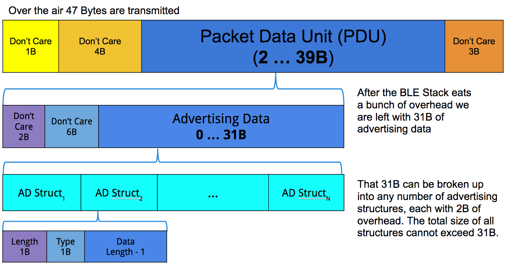
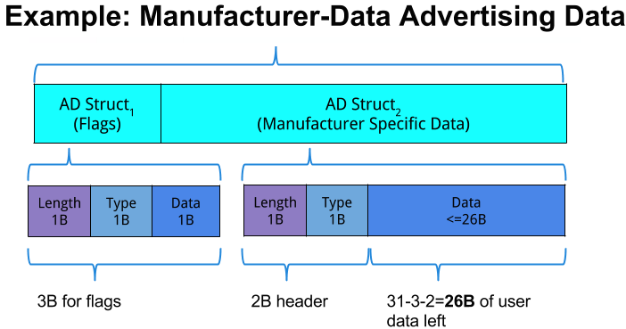
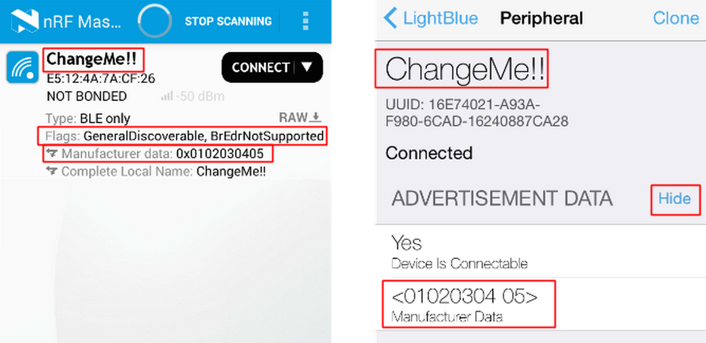
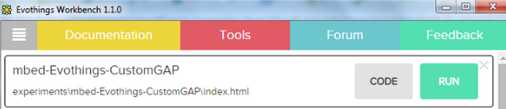
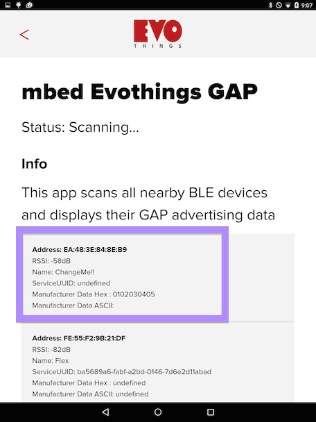

#Custom GAP advertising packet

We can change the content of the [generic access profile (GAP)](../Introduction/BLEInDepth.md#advertising-and-connected-mode) advertising packet (AP) to contain the information we want it to contain. If we have only a small amount of data we want to communicate to the world, then we can use the modified GAP AP to send that information to any BLE scanner, without waiting for it to establish a connection. In this article, we're going to modify advertising data step by step, then receive the result with a custom-built Evothings app.

<span class="tips">Get the code [here](http://developer.mbed.org/teams/Bluetooth-Low-Energy/code/BLE_GAP_Example/).</span>

##Prerequisites

You'll need:

1. A BLE-enabled mbed board. [Any of these will work](https://developer.mbed.org/platforms/?connectivity=3).

2. Install the [Evothings Workbench on your PC](http://evothings.com/download/) and the app on your phone. See here for [Android](https://play.google.com/store/apps/details?id=com.evothings.evothingsclient) or [iOS](https://itunes.apple.com/nz/app/evothings-client/id848974292?mt=8).

3. A tablet or smartphone with BLE.

3. The [LightBlue iOS](https://itunes.apple.com/us/app/lightblue-bluetooth-low-energy/id557428110?mt=8) app or the [nRF Master Control Panel Android](https://play.google.com/store/apps/details?id=no.nordicsemi.android.mcp&hl=en) app to view the results.

<span class="tips">For more information about Evothings, see their [Quick Start Guide](http://evothings.com/getting-started-with-evothings-studio-in-90-seconds/), [tutorials](http://evothings.com/doc/studio/tutorials.html) and [BLE API reference](http://evothings.com/doc/plugins/com.evothings.ble/com.evothings.module_ble.html).
</span>

##GAP data review

The general GAP broadcast's data breakdown is illustrated in this diagram:

<span class="images"><span>The BLE stack eats part of our package's 47B, so only 26B are available for our data</span></span>

Every BLE package can contain a maximum of 47 bytes (which isn't much), but:

1. The BLE stack requires 8 bytes (1 + 4 + 3) for its own purposes.

1. The advertising packet data unit (PDU) therefore has at maximum 39 bytes. But the BLE stack once again requires some overhead, taking up another 8 bytes (2 + 6).

2. The PDU's advertising data field has 31 bytes left, divided into advertising data (AD) structures. Then:

	* The GAP broadcast must contain flags that tell the device about the type of advertisement we're sending. The flag structure uses three bytes in total: one for data length, one for data type and one for the data itself. The reason we need the first two bytes (the data length and type indications) is to help the parser work correctly with our flag information. We have 28 bytes left.

	* Now we're finally sending our own data in its own data structure. But our own data structure also needs an indication of length and type (two bytes in total). So we have 26 bytes left.

All of which means that we have only 26B to use for the data we want to send over GAP.

And here's what the bottom two layers of structure look like for our particular example - sending manufacturer data:

<span class="images"><span>The example we use here only requires two data structures, one of 3B, one of 28B (of which two are used for data length and type indications)</span></span>

##Using the mbed BLE API

<span class="tips">[Get the code here](http://developer.mbed.org/teams/Bluetooth-Low-Energy/code/BLE_GAP_Example/).</span>

First, we need to include a couple of headers: for mbed and for BLE:

```c

	#include "mbed.h"
	#include "BLEDevice.h"
```

Then, we declare the BLE object:

```c

	BLEDevice ble;
```

Now we provide the name of the device:

```c
	
	// change the device's name
	const static char DEVICE_NAME[] = "ChangeMe!!"; 
```

We have up to 26 bytes of data to customise (less is fine, but you can't exceed 26 bytes!):

```c

	// example of hex data
	const static uint8_t AdvData[] = {0x01,0x02,0x03,0x04,0x05};   
```

We can use character data instead of hex:

```c

	// example of character data
	const static uint8_t AdvData[] = {"ChangeThisData"};         
```

<span class="notes">**Note:** most BLE scanner programs will only display the hex representation, so you may see the characters displayed as the numbers that represent them.</span>

All of that was just setup. Now we need to do something with it. We start by calling the initialiser for the BLE base layer:

```c

	int main(void)
	{
		ble.init();
```

<span class="notes">**Note:** the ``ble.init()`` should always be performed before any other BLE setup.</span>

Next, we set up the advertising flags:

```c

	    ble.accumulateAdvertisingPayload(GapAdvertisingData::
			BREDR_NOT_SUPPORTED | 
			GapAdvertisingData::LE_GENERAL_DISCOVERABLE );
    	ble.setAdvertisingType(GapAdvertisingParams::ADV_CONNECTABLE_UNDIRECTED);
```

The second half of the first line puts the advertisement in the *general discoverable* mode, and the last flag sets the type of advertisement to be a *connectable undirected advertisement*. These are the flags that will cost us a total of three out of the 31 bytes.

It is worth noting that the ``ADV_CONNECTABLE_UNDIRECTED`` flag could just as easily be ``ADV_NON_CONNECTABLE_UNDIRECTED`` if no connection is needed. We have chosen to use the connectable flag as some BLE apps will not display advertising data until a connection is established.

We can then set up the payload. The header ``MANUFACTURER_SPECIFIC_DATA`` is where we lose another two bytes of data. Once the header has announced the data we plug in the array we created earlier:

```c

	    ble.accumulateAdvertisingPayload(GapAdvertisingData::
			MANUFACTURER_SPECIFIC_DATA, 
			AdvData, sizeof(AdvData));
```

Notice that the ``AdvData`` variable is added to the BLE device at this point.

Now we set the [advertising interval](../Introduction/ConnectionParameters.md#setadvertisinginterval) and start advertising:

```c

    ble.setAdvertisingInterval(160); // 100ms; in multiples of 0.625ms.
    ble.startAdvertising();
```

This will take care of the GAP advertising on the mbed side.

##Seeing our data

Compile your program and install it on your board ([drag and drop it to the board](../mbed_Classic/URIBeacon.md#compiling-and-installing-your-program)). Then decide if you want to use generic apps or the custom-made Evothings app (or use both and compare results).

###Generic apps

On your phone, start the BLE application ([nRF Master Control Panel](https://play.google.com/store/apps/details?id=no.nordicsemi.android.mcp&hl=en) for Android and [LightBlue](https://itunes.apple.com/us/app/lightblue-bluetooth-low-energy/id557428110?mt=8) for iOS). It will scan for BLE devices, and should show us ours:

<span class="images"></span>

We can see the name we set, the appropriate flags and the data we pushed into the manufacturer data field.

###Evothings custom-made app

We've created an Evothings GAP smartphone example that works with the embedded mbed example above.

To run the app:

1. Make sure you've installed the Evothings Workbench on your computer and the Evothings client on your phone.

2. Connect the workbench on your computer to the client on your smartphone (it will ask for your computer's IP address).

3. Click **RUN** on the "mbed Evothings GAP" program on the workbench.

4. The code will run on your phone's Evothings client.

<span class="images"></span>

The phone app will show:

<span class="images"></span>

The code for the application is in the **app.js** file. It is written in JavaScript and can be modified in real time. Try making a modification, save the changes, and watch them load to the Evothings client on your phone.

This demo is very simple but provides a starting point for more advanced programming.
