#Firmware Over the Air

Firmware Over the Air (FOTA) is our latest development for Bluetooth Low Energy (BLE) devices. We're working towards enabling FOTA for the platforms based on Nordic's [nRF51822](http://developer.mbed.org/platforms/Nordic-nRF51822/) Bluetooth system, so that any BLE application may enable FOTA by the simple addition of a Device Firmware Upgrade (DFU) service to its GATT server.

You can view a [short video about FOTA](https://www.youtube.com/watch?v=54V2_4TR9Wo#t=114), starting at 01:55. We'll show you the same example, in greater detail, below. 

Note that this functionality requires the use of a (Nordic-specific) DFU boot loader on the device, to provide the basic functionality of firmware download and reprogramming. Instructions for the boot loader’s installation are available below.

<span style="background-color:#E6E6E6; border:1px solid #000;display:block; height:100%; padding:10px">
**Warning:** at the moment, the firmware-update protocol has very little security; we're working on this.
</span>

We’ll start with a general review of the software components needed to support FOTA, and then move to an execution example to show just how easily a FOTA update can be performed.

##Software Components

The following figure shows the layout of the main software components of a FOTA-capable system. These include:

1.	**SoftDevice:** Nordic's encapsulation of the Bluetooth stack.

2.	**Application:** the user's BLE application.

3.	**Boot loader:** responsible for firmware updates.

<span style="text-align:center; display:block;">
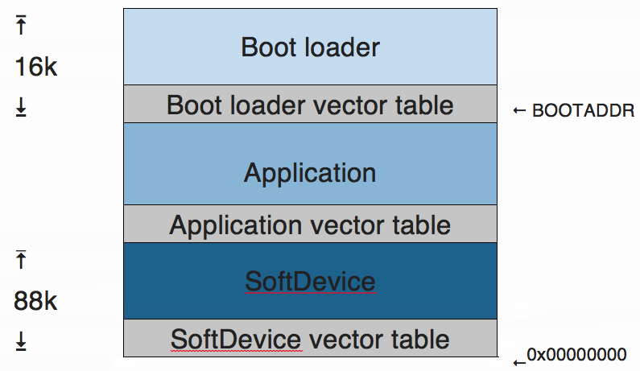
</span>
<span style="background-color: #F0F0F5; display:block; height:100%; padding:10px;">
*Main software components in a FOTA-dapable system*</span>

###How FOTA Updates Work

FOTA updates rely on the SoftDevice and boot loader:

1.	On power up, the SoftDevice checks the User Information Configuration Register (UICR). The UICR can point either to the app or to the boot loader. 
	* If the UICR points to the app, the SoftDevice passes control to the app, which starts up normally.
	
	* If the UICR points to the boot loader, the SoftDevice passes control to the boot loader. The UICR will point to the boot loader if the boot loader had overwritten it; see our Default Boot Loader to understand how that's done. For a FOTA platform, a bootloader is always resident, with the UICR pointing to it.

2.	The boot loader determines if either control needs to be forwarded to the application or if it should remain waiting for a new application firmware image to be sent over the DFU service. The former case being the default. 

FOTA is reliable, but the application might block it by hanging in interrupt context (preventing the BLE stack from receiving an update, which prevents FOTA’s forwarding control to the boot loader). In this case, you’ll have to restart the device to enable further updates.  

The FOTA process can currently be driven from an external BLE agent, such as an Android phone. For the moment, we recommend using [Nordic's nRF Master Control Panel](https://play.google.com/store/apps/details?id=no.nordicsemi.android.mcp) as a generic tool. You can see more information about it below.

We'll soon be releasing our own reference apps for iOS and Android, together with SDKs to build custom apps for FOTA. 

<span style="text-align:center; display:block;">
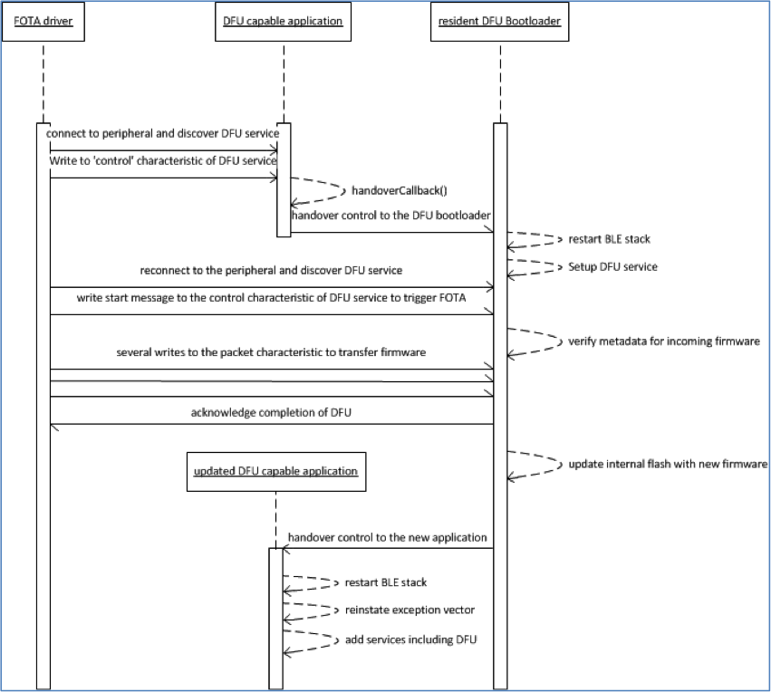
</span>
<span style="background-color: #F0F0F5; display:block; height:100%; padding:10px;">
*FOTA sequence diagram*</span>

###The Default Boot Loader

The boot loader must be preinstalled on the device. To install a fully-functional default boot loader, please download [this image](https://developer.mbed.org/media/uploads/rgrover1/ble_default_bootloader_app.hex). Remember that it is designed for the Nordic nRF51822 mKIT. 

The image also contains a default application, which serves as an example of FOTA implementation. See below for more information. 

###Update Packages

mbed platforms typically come with an interface chip called [CMSIS-DAP](https://developer.mbed.org/handbook/CMSIS-DAP), which offers drag-n-drop programming (usually over USB). This mechanism erases everything on the chip before programming the new firmware, so binaries used with this method must include the SoftDevice and any other pre-requisites. FOTA application updates are different; they affect only the application, so the SoftDevice and boot loader aren't deleted, and therefore don't need to be included in the application update package. This reduces the size of the package, helping it meet BLE limitations. 

###Virtual Platforms

As we said, FOTA applications don't need to be combined with the SoftDevice as they do not erase the existing SoftDevice. They therefore need a separate (virtual) build target for each Nordic platform. These are generated by building for "shadow" platforms specifically intended for FOTA. You can get virtual platforms for [mKIT](https://developer.mbed.org/platforms/Nordic-nRF51822-FOTA/), [nRF-DK](https://developer.mbed.org/platforms/Nordic-nRF51-DK-FOTA/) and others. You'll need to add these to your online compiler and build for them when generating FOTA binaries.

###Adding DFU Support to an Application

When you build for a FOTA-enabled platform, an instance of DFUService is implicitly added during the call to ble.init(). The assumption is that any application built for a FOTA-enabled platform wants to enable FOTA.

If you're building for a non-FOTA platform, you'll need to explicitly introduce DFUService support into an application; this requires only two lines of code:

1. Include the ``DFUService.h`` header.

2. Call the service, as shown below:

```c

	/* Enable over-the-air firmware updates. 
	*Instantiating DFUSservice introduces a
	* control characteristic which can be used to 
	* trigger the application to
	* handover control to a resident bootloader. */

	DFUService dfu(ble);
```

##Running a FOTA Update

The next three sections explain how to use Nordic's Master Control Panel to view, trigger and drive a FOTA update. As an example, we’ll update the default app bundled into the initial boot loader image. Among other services, this application offers a DFU service that supports FOTA.

You can view a [short video demonstrating this](https://www.youtube.com/watch?v=54V2_4TR9Wo#t=114), starting at 01:55.

###Viewing the DFU Service

The following images show how to use Nordic's Master Control Panel to view a DFU-capable application.

* The default app (DefaultApp), listed in the Master Control Panel. Tap the app to view more information.

<span style="text-align:center; display:block;">
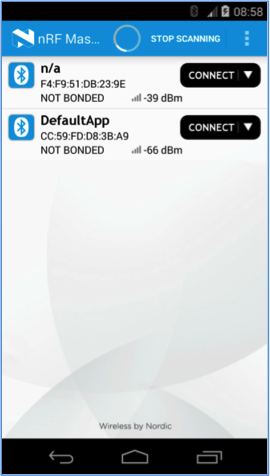
</span>

* General information for the default app. Note the Device Firmware Update Service section; tap the section to view more information.

<span style="text-align:center; display:block;">
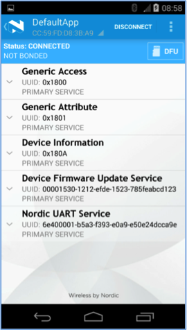
</span>

* Detailed information for the Device Firmware Update Service.

<span style="text-align:center; display:block;">
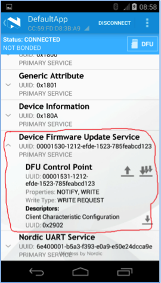
</span>

###Triggering FOTA

The following images show how Nordic's Master Control Panel can be used to cause a DFU-capable application to forward control to the boot loader. The boot loader then checks for firmware updates on the server and transfers them to the device:

* We start at the detailed view of the app that we saw in the previous section. The DFU Control Point offers FOTA triggers.

<span style="text-align:center; display:block;">

</span>

* Tap the up arrow to view the write options. This is the FOTA’s control-point.

<span style="text-align:center; display:block;">
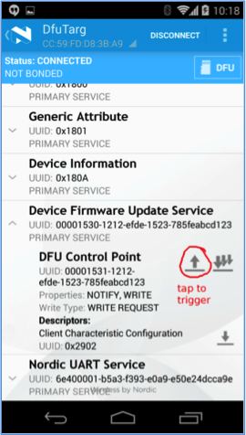
</span>

* The control-point options are:
	* SoftDevice.
	* Boot loader.
	* Application.

<span style="text-align:center; display:block;">
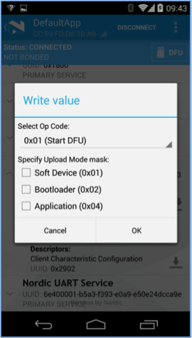
</span>

* For this example, we select the third option: Application.

<span style="text-align:center; display:block;">
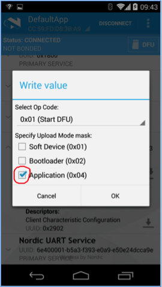
</span>

* The Master Control Panel now shows the default application under the name DfuTarg, indicating that the boot loader is running.

<span style="text-align:center; display:block;">
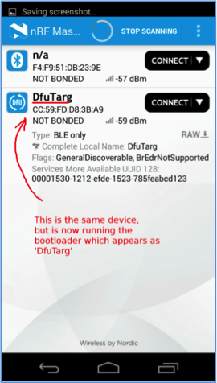
</span>

###Driving FOTA

Finally, these images show the main FOTA sequence using the boot loader:

* We start at the detailed view of the app that we saw in the first section. Since we already triggered FOTA in the previous section (meaning we transferred control of the application to the DFU-service), we can now update the application.

<span style="text-align:center; display:block;">
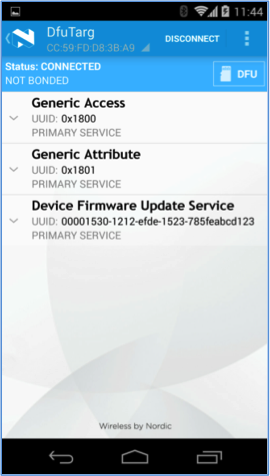
</span>

* Tap the DFU button to select a file type.


<span style="text-align:center; display:block;">
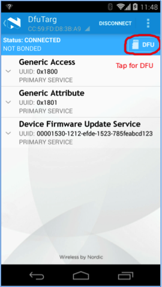
</span>

* The file type options are:
	* SoftDevice.
	* Boot loader.
	* Application.
	* Multiple files (in ZIP format).
<br /><br />For this example, we select the Application file type.


<span style="text-align:center; display:block;">
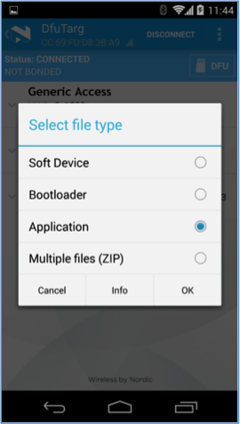
</span>

* We can now select a source for the file.


<span style="text-align:center; display:block;">
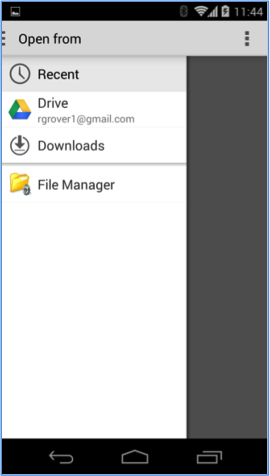
</span>

* The update begins as soon as we select the file. We can see its progress, and the transfer speed.


<span style="text-align:center; display:block;">
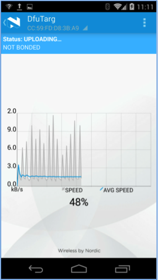
</span>


* When the update is finished, we return to the Master Control Panel. The application is no longer under the boot loader’s control. Instead, it is back under its own control, and is therefore no longer listed as DfuTarg (note that the update changed the application’s name, so that it is also no longer called DefaultApp). 


<span style="text-align:center; display:block;">
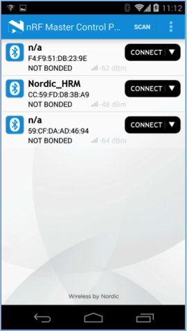
</span>

###Attribute and Service Caching

Note that a GATT client app often caches the results from a service discovery. However, after changing or updating an application – and especially after replacing it with a different application – your app may need to re-discover services. You may therefore want to restart the app or the Bluetooth service after a FOTA update.

##UART Access over BLE
###Overview

If you want to receive console outputs from an updated app, it is possible to do so over the BLE UART Service. For instance, the default app that comes bundled with the boot loader generates regular pings on the RX characteristic of the UARTService. These pings can be received using several UART apps, such as Nordic's nRF UART.

Please note:

1.	At the moment, you cannot have more than one active connection to a BLE device. For example, if you're working with a heart-rate application and you've connected to it using nRF UART for console output, then you cannot simultaneously connect to it from another heart-rate phone app.

2.	Console messages are sent in notification packets of up to 20 bytes; this limit is imposed by the Bluetooth standard. Longer messages need to be cropped into a sequence of 20-byte packets. 

3.	Output buffers internal to the UARTService are flushed upon encountering a newline character; the receiving UART application should be able to stitch together cropped portions of longer messages.

###Using the UART Service

The following program illustrates the use of UARTService to redirect something like printf() to use the BLE transport.

<span style="background-color:#E6E6E6; border:1px solid #000;display:block; height:100%; padding:10px">
[Import the BLE_UARTConsole program to your compiler](https://developer.mbed.org/teams/Bluetooth-Low-Energy/code/BLE_UARTConsole/).
</span>

```c

	#if NEED_CONSOLE_OUTPUT
	#define DEBUG(STR) { if (uart) uart->write(STR, strlen(STR)); }
	#else
	#define DEBUG(...) /* nothing */
	#endif /* #if NEED_CONSOLE_OUTPUT */

		uart = new UARTService(ble);
		DEBUG("ping\r\n");
```

<span style="background-color:#E6E6E6; border:1px solid #000;display:block; height:100%; padding:10px">
**Note:** You will need to include ``UARTService.h.``
</span>

##Limitations of the Current Implementation

* There is no security or safety built into the process yet; anyone with the right tools can update a FOTA-capable target. Resolving this is very high on our priorities.

* Building FOTA binaries currently requires using a "shadow" build platform for every target. This process is cumbersome and should be simplified. 

* FOTA requires installing an initial image containing the boot loader. For non-official mbed platforms, this means that a user would need to understand the internals well enough to be able to build an initial image, and also find a programming interface to transfer it to the target. We're working on releasing a USB->SWD adaptor that can target nRF51822 boards that don't have an mbed CMSIS-DAP interface.

* The two-stage FOTA process is cumbersome and error-prone. We're working on creating a simple reference app to drive FOTA. Eventually we hope to release an SDK to allow users to create their own FOTA driver applications.

______
Copyright © 2015 ARM Ltd. All rights reserved.

