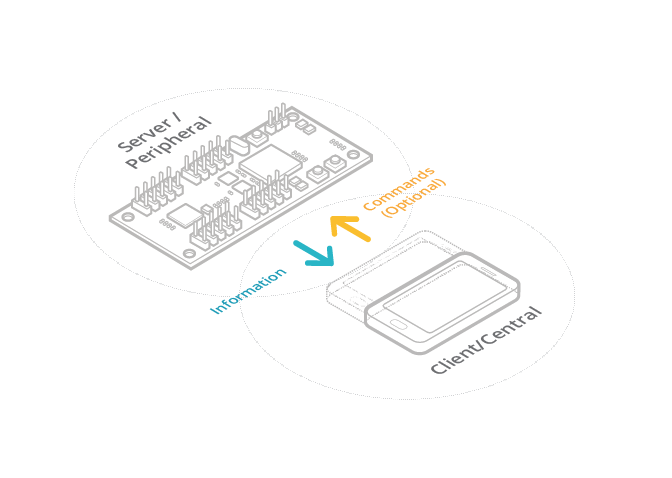
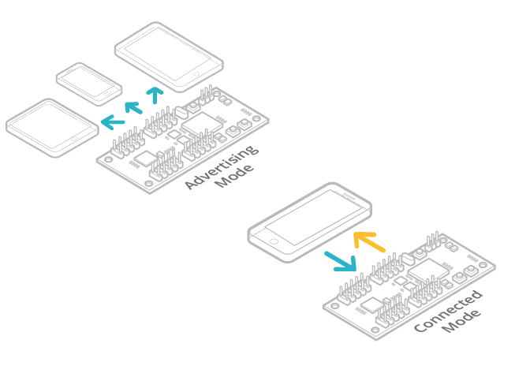
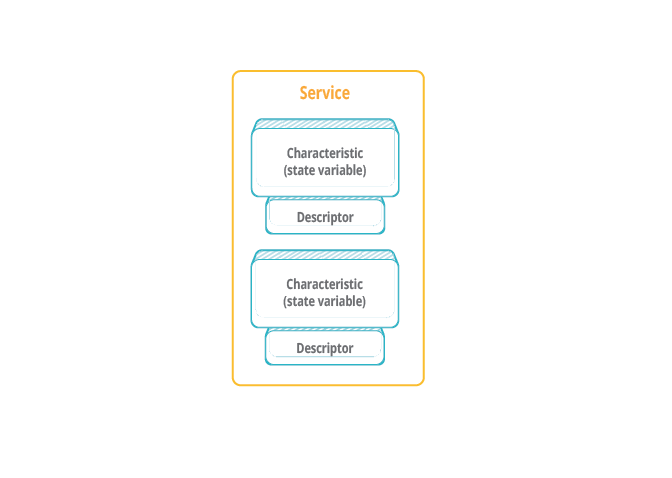
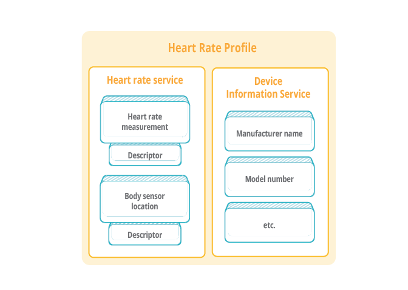
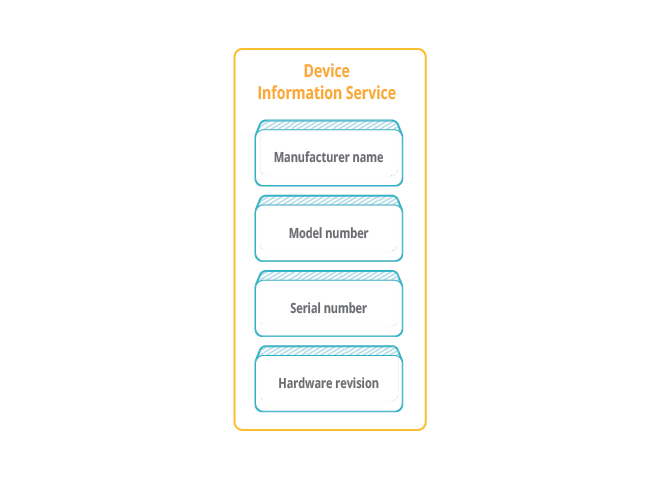
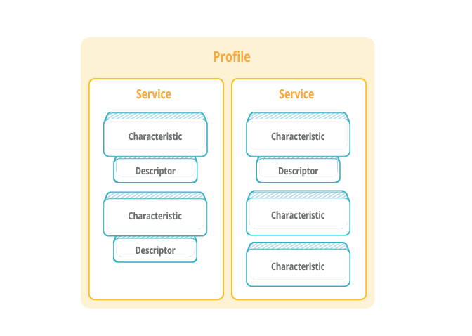

#BLE Modes and Profiles

This document explores how BLE works, especially how you can use the two BLE modes - connected and advertising - for different purposes. 

##Peripheral and Central Devices v Servers and Clients

When we connect devices over BLE, we think of them as being either a peripheral (slave) device or a central (master) device. The Bluetooth standard established this division to match the resources available on the devices: 

**Master/central**
:	will typically have more computing resources and available energy - a computer or a tablet, for example.

**Slave/peripheral**
:	an mbed device - will be constrained in both computing resources and energy. 

Currently, mbed's BLE_API supports the creation of peripheral devices. We plan to extend this to central devices soon.

BLE uses two additional terms to describe the connecting entities - server and client:

**Server**
: 	the device that has information it wishes to share, and in BLE that 	is typically the peripheral (the mbed board).

**Client**
: 	the device that wants information and services, and in BLE that is 	typically the central device - the phone.

We use the terms *server* and *client* when discussing the exchange of information. We use *central* and *peripheral* to denote the origin and target of a BLE connection. It is not uncommon for the central to be connecting as a client, and the peripheral to be acting as a server. 

<span style="text-align:center; display:block;">

</span>
<span style="background-color: #F0F0F5; display:block; height:100%; padding:10px;">
The mbed board is the server or peripheral; the phones are the clients and central devices
</span>


##Initiating Connections

The central initiates, controls and ends the connection - the peripheral cannot force the central to act (scan for BLE devices, view their information, connect and so on). The central also decides how often to ask the peripheral for information. However, the peripheral can recommend some things to the central. For more information about these decisions, see the [connection parameters section](../Introduction/ConnectionParameters.md).

##Advertising and Connected Mode

The two modes BLE uses are: 

**Advertising mode**
:	the peripheral sends out a bit of information that any device in the area can pick up. This is how central devices know that there are peripherals around. 

**Connected mode**
:	the peripheral and a central device establish a one-to-one conversation. This is how they can exchange complex information. 

A central device must know that a peripheral device exists to be able to connect with it. A peripheral will therefore advertise its presence using the BLE ***advertising mode***. In this mode, the device uses the *Generic Access Profile* (GAP) to send out a bit of information - an advertisement - at a steady rate. This advertisement is what other devices, like your phone, pick up. It tells them about the presence of a BLE device in the neighbourhood, and whether that device is willing to talk to them.

<span style="text-align:center; display:block;">

</span>
<span style="background-color: #F0F0F5; display:block; height:100%; padding:10px;">
Advertising mode is one-to-many, whereas connected mode is one-to-one
</span>

Advertisements are very limited in size. The general GAP broadcast's data breakdown is illustrated in this diagram:

<span style="text-align:center; display:block;">

</span>
<span style="background-color: #F0F0F5; display:block; height:100%; padding:10px;">
The BLE stack eats part of our package's 47B, until only 26B are available for our data</span>

Every BLE package can contain a maximum of 47 bytes (which isn't much), and we don't get to use all of it:

1. The BLE stack require 8 bytes (1 + 4 + 3) for its own purposes.

1. The advertising packet data unit (PDU) therefore has at maximum 39 bytes. But the BLE stack once again requires some overhead, taking up 8 bytes (2 + 6).

2. The PDU's advertising data field has 31 bytes left, divided into advertising data (AD) structures. Then:

	* The GAP broadcast must contain flags that tell the device about the type of advertisement we're sending. The flag structure uses three bytes in total (one for data length, one for data type and one for the data itself). The reason we need the first two bytes - the data length and type indications - is to help the parser work correctly with our flag information. We have 28 bytes left.

	* Now we're finally sending our own data in its own data structure - but it, too, requires an indication of length and type (two bytes in total), so we have 26 bytes left.

All of which means that we have only 26B to use for the data we want to send over GAP.

<span style="background-color:#E6E6E6; border:1px solid #000;display:block; height:100%; padding:10px">
If you want to see an example of ADs, see our extended explanation in the [Custom GAP Advertising section](../Advanced/CustomGAP.md).
</span>

For many applications, advertisements may be all that's needed. This may be when:

* A peripheral only wants to periodically broadcast a small amount of information that can fit in an advertisement. 
* It's also okay for this data to be available to any central device within range, regardless of authentication. 

But sometimes you'll want to provide more information or more complex interactions than one-way data transfers. For that you'll need to set up a "conversation" between your BLE device and a user's phone, tablet or computer. This conversation is based on ***connected mode***, which describes a relationship between only two devices: the peripheral BLE device and the central device.

For now, advertising and connected modes cannot co-exist. This is because a BLE peripheral device can only be connected to one central device (like a mobile phone) at a time. The moment a connection is established, the BLE peripheral will stop advertising. At that point, no other central device will be able to connect to it, since they can't discover that the device is there if it's not advertising. New connections can be established only after the first connection is terminated and the BLE peripheral starts advertising again. 

<span style="background-color:#E6E6E6; border:1px solid #000;display:block; height:100%; padding:10px">
**Note:** the latest Bluetooth standard allows advertisements to continue in parallel with connections, and this will become a part of mbed's BLE_API before the end of 2015. 
</span>

##Services and Profiles (GATT)

To make the conversation described above low power, the BLE specification imposes a specific structure on the way data is exchanged in connected mode. It relies on the BLE peripheral's ability to maintain a database of state variables, such as battery level, temperature and time, that clients can access. We can group state variables into services based on functionality. The Heart Rate Service, for instance, is a collection of state variables including *heart rate measurement* and *body sensor location*. The technical term for these state variables is “Characteristics”. For the sake of interoperability, each characteristic also holds a description of the value’s type. This  allows clients to interpret the value even if they’ve not been specifically programmed to recognise it. 

<span style="text-align:center; display:block;">

</span>
<span style="background-color: #F0F0F5; display:block; height:100%; padding:10px;">
A single service can contain several characteristics</span>

Services, characteristics and their supporting attributes are the fundamental entities of connected mode. Services use the Generic Attribute Profile (GATT) to structure information according to characteristics. We'll explore characteristics in more detail below. 

We bundle services into a *profile*. For example, the Heart Rate *Profile* includes two services - Heart Rate and Device Information - and the Blood Pressure *Profile* includes the Blood Pressure and Device Information services.

<span style="text-align:center; display:block;">

</span>
<span style="background-color: #F0F0F5; display:block; height:100%; padding:10px;">
An example profile with two services</span>

BLE has been around for a while, so it has some standard services that you can tap into. Going back to our heart rate monitor example, the Heart Rate Service is well established and easy to use. It can read information from a BLE heart rate monitor and send it to an app. You'll see that in a later [coding sample](../mbed_Classic/HeartRate.md).

Before you start working on a project, it's worthwhile to see if there's already a service that can do what you need done; it'll save you lots of coding and testing. You can find the list of available profiles and services [here](https://developer.bluetooth.org/TechnologyOverview/Pages/Profiles.aspx).

##Characteristics and Interactions

Services break their data down into *characteristics*. Each characteristic is mapped onto a single data point: it tells you one thing, and one thing only. For example, the [Device Information Service](https://developer.bluetooth.org/TechnologyOverview/Pages/DIS.aspx) has the following characteristics:

<span style="display:block; float:right;">

</span>

* Manufacturer name.

* Model number.

* Serial number.

* Hardware revision.

* Firmware revision.

* Software revision.

* System ID.

* IEEE 11073-20601 regulatory certification data list.

Each of these characteristics should only contain the information its label says it contains. Together, they reveal the device's manufacturer information and make up a full Device Information Service. This service is itself bundled into quite a few profiles.

Creating a characteristic on mbed is very easy, because ``BLE_API`` offers C++ abstractions for entities involved in the definition of services. For example, here we create a simple characteristic that notifies the client of the state of a button (pressed/released):

```c

	//button initial state
	bool buttonPressed = false; 
	//read-only characteristic of type boolean, 
	//accepting the buttonState’s UUID and initial value
	ReadOnlyGattCharacteristic<bool> buttonState(BUTTON_STATE_CHARACTERISTIC_UUID, 
		&buttonPressed);
```

<span style="background-color:#E6E6E6; border:1px solid #000;display:block; height:100%; padding:10px">
For a full walkthrough of characteristic creation on mbed, see our [input service template](../Advanced/InputButton.md#the-button-state-characteristic).
</span>

A characteristic is fully defined by its declaration, value and descriptor:

1. The **declaration** contains data about the characteristic, such as its universally unique identifier (UUID).

2. The **value** is the “interesting” part of the characteristic: it’s the value that contains the data you’re viewing and reacting to.

3. The **descriptor** is not mandatory; you can use it to provide more information about a characteristic or to control its behaviour. For example, descriptors are used when working with notifications.

Characteristics can be either static (like your device's manufacturer name) or dynamic. If a characteristic is dynamic, your device can generate a new value for it when it has new information. For example, in the Heart Rate Service, the *current heart rate* is a characteristic that gets a new value regularly.

Here's an example of creating a read/write characteristic (a characteristic that can receive new values and reveal its current value):

```c

	bool initialValueForLEDCharacteristic = false;
	ReadWriteGattCharacteristic<bool> ledState(LED_STATE_CHARACTERISTIC_UUID, 
		&initialValueForLEDCharacteristic);
```

<span style="background-color:#E6E6E6; border:1px solid #000;display:block; height:100%; padding:10px">
For information about creating a read/write characteristic on mbed, see our [actuator service template](../Advanced/LEDReadWrite.md#the-led-state-characteristic).
</span>

Some characteristics are two-way entities. That means the server (BLE peripheral) can both update them itself and receive new values for them from the client (phone). This two-way traffic makes BLE interactive: the user sends a new value to one or more characteristics and the device responds to these new values. For example, when a URI Beacon device is turned on, it goes into a temporary *configuration mode*, giving us a chance to update the values of its characteristics (containing the data it will later advertise). 

<span style="background-color:#E6E6E6; border:1px solid #000;display:block; height:100%; padding:10px">
For information about the configuration mode, see the [URI Beacon Advanced Features page](../Advanced/URIBeaconAdv.md).
</span>

The service definition states, for each characteristic, whether clients have permission to write to that characteristic. This is done when setting up the GATT server on the peripheral. In our example, the *configuration mode* states that the advertising information is read/write, and the *advertising mode* states that it is read-only. The same characteristic can, therefore, have two different permissions, depending on the device's mode. 

##UUIDs

Each service and characteristic requires a universally unique identifier (UUID), listed in the declaration (as we saw above). For official BLE entities the UUID is 16-bit, and a full list is available on the BLE site for [services](https://developer.bluetooth.org/gatt/services/Pages/ServicesHome.aspx) and [characteristics](https://developer.bluetooth.org/gatt/characteristics/Pages/CharacteristicsHome.aspx). For services and characteristics that you create yourself, you’ll need 128-bit UUIDs; you can generate those on the [UTI website](http://www.itu.int/en/ITU-T/asn1/Pages/UUID/uuids.aspx).

More information about UUID assignments is available in our [service creation samples](../Advanced/Overview.md).
 
##Profiles, Services and Characteristics - a Summary

The full breakdown for a profile is, therefore: one or more services, each containing zero or more characteristic, with zero or more descriptors for every characteristic:

<span style="text-align:center; display:block;">

</span>
<span style="background-color: #F0F0F5; display:block; height:100%; padding:10px;">
A single profile can contains several services, and each of the services can contain several characteristics</span>

______
Copyright © 2015 ARM Ltd. All rights reserved.
