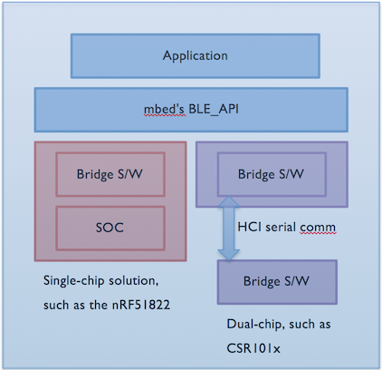
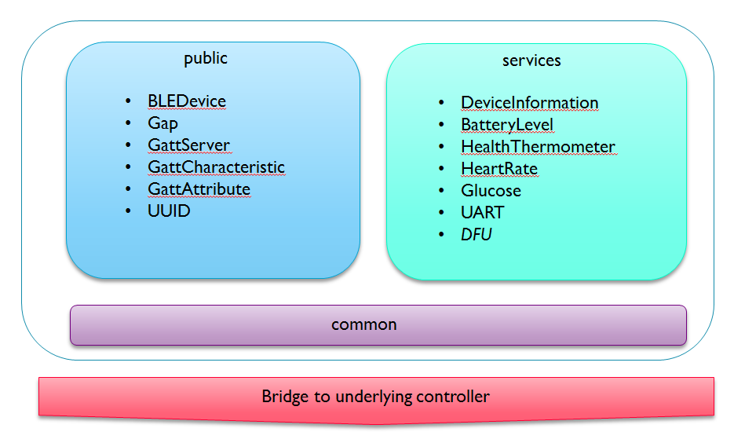

#mbed's BLE_API

mbed development relies on APIs to do the grunt work of controlling the platforms, freeing developers to focus on their programs. And because the API takes responsibility for platform compatibility, developers can reuse their code on any supported platform.

While the mbed OS interfaces with the platform itself, mbed’s BLE_API interfaces with the BLE controller on the platform. It's designed to hide the BLE stack’s complexity behind C++ abstractions and is compatible with all BLE-enabled mbed platforms. mbed OS and the BLE_API together let developers implicitly benefit from all the low-power optimisations the hardware offers by automatically configuring the clocks, timers and other hardware peripherals to work at their lowest power consumption. All that developers have to do is remember to yield to the BLE_API ``waitForEvent()`` function whenever the system needs to idle (for more information about ``waitForEvent()``, see our [event-driven programming section](../mbed_Classic/Events.md).

<span style="background-color:#E6E6E6;  border:1px solid #000;display:block; height:100%; padding:10px">**Note:** the API is shared between all mbed OS versions.</span>

##BLE_API, bridges and stacks

<span style="float:right; display:block; padding:5px;">

</span>

A BLE application is built using mbed OS (which currently takes the form of the mbed SDK), BLE_API, and a controller-specific Bluetooth stack together with some bridge software to adapt it to BLE_API:

* BLE_API as described above. The API is developed on [GitHub](https://github.com/mbedmicro/BLE_API/) and mirrored on [mbed.org](http://developer.mbed.org/teams/Bluetooth-Low-Energy/code/BLE_API/).

* The bridge software is specific to each vendor’s platform. It provides the instantiations for the interfaces offered by BLE_API, and helps drive the underlying controller and Bluetooth stack.

* The Bluetooth stack implements the Bluetooth protocol, and is specific to the controller, so a vendor using different controllers may provide different stacks.

##Inside BLE_API

<span style="text-align:center; display:block; padding: 10px;">

</span>

BLE_API offers building blocks to help construct applications. These fall into three broad categories: 

1. Interfaces under **'public/'** to express BLE constructs such as GAP, GATT, services and characteristics.

2. Code under **'common/'** encapsulates headers that need to be shared between the public interfaces and underlying bridge code.

3. Classes under **'services/'** to offer reference implementations for many of the commonly used GATT profiles. The code under 'services/' isn't essential, but it’s a useful starting point for prototyping. We continue to implement the standard GATT profiles, so these classes are updated from time to time. For a full list, see the [folder](https://github.com/ARMmbed/ble/tree/master/ble/services).

##The BLEDevice class and header

The heart of mbed's BLE_API is the`` BLEDevice`` class, accessible in the IDE via the header ``BLEDevice.h``. This class allows us to create a BLE object that includes the basic attributes of a spec-compatible BLE device and can work with any BLE radio:

```c

	#include "BLEDevice.h"

	BLEDevice mydevicename;

```

The class's member functions can be divided by purpose:

1. Basic BLE operations such as initialising the controller.

2. GAP related methods: radio transmission power levels, advertisements, and parameters affecting connection establishment.

3. GATT related methods: to set up and control the GATT database describing services together with the characteristics and attributes composing them.

4. Event-driven programming controls, such as methods to set up various callbacks to be invoked in response to system events. 

##Sample mbed BLE apps

We have examples of mbed OS BLE apps, along with documentation [for mbed OS 5](https://github.com/ARMmbed/mbed-os-example-ble) and [mbed OS 3](https://github.com/ARMmbed/ble-examples).

##Full BLE_API documentation

[You can read](https://docs.mbed.com/docs/ble-api/en/master/api/index.html) the current API documentation.

