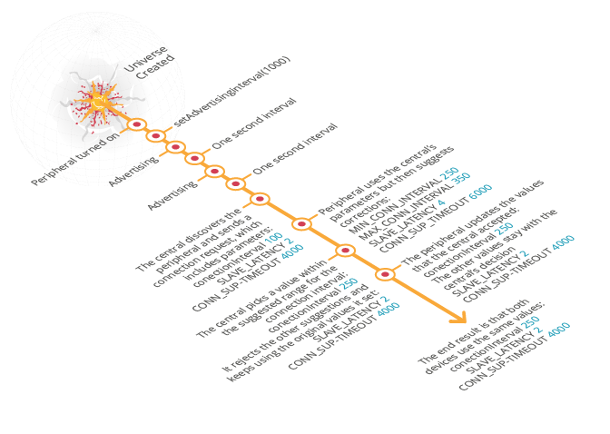

#Connection Parameters

There are several parameters that affect the connection between the central and peripheral devices. These in turn affect the device's power consumption: the more radio activity on the device, the greater the consumption. 

##setAdvertisingInterval()

When the peripheral device is in advertising mode it sends advertising packets at a fixed interval, as short as 20 milliseconds or as long as 10.28 seconds. A short interval allows the central device to find the peripheral quickly, but because it requires frequent radio work the power consumption is higher. It is therefore a balancing act between speed and battery use.

The advertising interval is completely under the peripheral device's control. This is unlike the other connection parameters, as you'll see below, which are suggestions that the central device can ignore.

The interval is set using ``setAdvertisingInterval``: a function in the ``BLEDevice`` class of ``BLE_API``. The function accepts a value in milliseconds. 

```c

	 ble.setAdvertisingInterval(1000); // one second
```

<span style="background-color:#E6E6E6; border:1px solid #000;display:block; height:100%; padding:10px">
**Note:**
<br />1. If you set 0, advertising will be disabled.
<br />2. It should be set to 0 (that is, disabled) when the connection mode is ``ADV_CONNECTABLE_DIRECTED`` (meaning that only connections from a pre-defined central device will be accepted).
<br />3. If you set a value lower than the minimum (20), the minimum will be used automatically.
</span>

##Connection Interval and Slave Latency

When a connection between the peripheral and central devices is established (connected mode), the central decides how often to synchronise with the peripheral. This decision is one sided: the peripheral cannot force anything on the central. It can, however, make suggestions that the central may choose to honour. 

The peripheral's suggestions are made using three parameters: ``MIN_CONN_INTERVAL`` (for the shortest interval) and ``MAX_CONN_INTERVAL`` (for the longest interval), which together describe the interval range; and ``SLAVE_LATENCY``, which defines the number of times a peripheral can ignore a connection event.

###Connection Intervals

The interval parameters receive values in milliseconds. For example, the following code means that the shortest interval time is 250 milliseconds, and the longest is 350 millisecond:

```c

	#define MIN_CONN_INTERVAL 250 //250 milliseconds
	#define MAX_CONN_INTERVAL 350 //350 milliseconds
```

The connection interval cannot be shorter than 7.5 milliseconds or longer than four seconds. The central will either pick a value between the min and max suggested by the peripheral or enforce its own value. It's important to understand that while the peripheral can suggest a range (two values), in the end only one value can be used. This is because the synchronisation itself must always happen at a fixed interval, not a random point on a range. The two parameters are used only when the peripheral is suggesting a range to the central. When the central picks a value, it's stored in a new variable and the connection refers only to that variable.

Connection interval is a misleading name; it is not the case that a new connection is re-attempted at each connection event. Rather, within the context of an ongoing connection, a connection event allows the two sides to send and receive. Specifically, the BLE device has the opportunity to send notifications to the client if there is any state-change to report.

###Slave Latency

Ideally, when a BLE device (particularly a peripheral) is inactive it would like to sleep to save its battery. That means it doesn't want to process information or respond to connection events. But the client, which is often less energy constrained (a rechargeable phone or tablet), may want to synchronise with the peripheral frequently to stay up to date. It will therefore constantly initiate connection events, waking the peripheral. When the peripheral is answering the client despite having no new information it is wasting a lot of energy. 

One way this situation is mitigated is using the ``SLAVE_LATENCY`` parameter. This parameter is set by the central device, but the peripheral can make a suggestion based on what it knows about its own operations. 

``SLAVE_LATENCY`` allows the peripheral to handle connection events based on the existence of new data:

* If there is no new data to send, the peripheral can ignore the number of consecutive connection events specified in the parameter. This means that the peripheral can continue sleeping, despite the client's attempt to synchronise.

* Even while there is no new data, the peripheral must still respond to the client periodically in order to prove that the connection is still alive.

* If there is new data to send, the peripheral will respond to a connection event no matter how long it's been since the last time it responded to an event.

The slave latency parameter accepts an integer specifying the number of connection events that may be ignored. For example, the following code means that the device can ignore four consecutive connection events, but must then respond to the fifth:

```c

	#define SLAVE_LATENCY 4 // four events can be ignored, the fifth must be met
```

The difference between SLAVE_LATENCY and MIN_CONN_INTERVAL is state-dependence. MIN_CONN_INTERVAL is state *independent*: it's used even when there is new data to send. SLAVE_LATENCY is state *dependent*: it's used only when the peripheral device has no data. The combination of these parameters allows us conditional control of our radio usage: we’ll communicate often when there is new information, but rarely when there is no information. A good example is a BLE mouse. To save energy, we don’t want to use the radio often when the user isn’t moving the mouse. But for ease of use, we don’t want slow communication when the user is using the mouse (slow communication will make the mouse lag behind the user’s actions). We’ll therefore set a high latency but low minimum connection interval.

<span style="background-color:#E6E6E6; border:1px solid #000;display:block; height:100%; padding:10px">
**Note:** the maximum value of SLAVE_LATENCY depends on the stack you're using. Check your vendor's specifications.</span>

##Putting it Together

Here's a diagram describing an interaction between a peripheral and a central. Note that in this example we've named the variable holding the connection interval ``connectionInterval``:

<span style="text-align:center; display:block;">

</span>

##Connection Supervision Timeout

Sometimes devices lose the connection between them, for example when they move out of each other's transmission range. The devices don't know whether the connection was lost, but they can assume it was if enough time has gone by without receiving any information from the other side. The time we define as "enough" to determine that the connection was lost is called *timeout*. The Connection Supervision Timeout parameter defines the time to wait for a data transfer before assuming that the connection was lost.

In our samples, this parameter is called CONN_SUP_TIMEOUT, and receives a value in milliseconds. For example, the following code means that the timeout is six seconds:

```c

	#define CONN_SUP_TIMEOUT 6000 // six seconds
```

The connection supervision timeout is a suggestion that the central device is free to ignore. This limits our ability to use the other parameters to create a long gap between data transfers, because long gaps require coupling the other parameters with a long supervision timeout. If the central rejects our supervision timeout while accepting the other parameters, it could set a long gap but a short timeout. It will then assume we disconnected.

<span style="background-color:#E6E6E6; border:1px solid #000;display:block; height:100%; padding:10px">
**Note:** the maximum value of CONN_SUP_TIMEOUT depends on the stack you're using. Check your vendor's specifications.
</span>

##Maximising Battery Life

Since the connection parameters have an impact on energy consumption, we should always put some thought into them - even knowing that the central may choose not to honour our suggestions. One consideration is that our connection interval should match the rate at which we expect to generate new data. For example, if we have a sensor taking a reading every second, the connection interval shouldn't be much smaller than that. If it's smaller, we'll be dealing with a lot of requests when no data is generated. As a contrary example, for applications where data updates occur non-periodically (such as mouse movements), the connection interval may determine the delay experienced by the user as the application waits for updates. Since we value user experience above energy, we'll use a short connection interval. We could complement the short connection interval with a high slave latency, letting the mouse sleep longer between motions.

For battery life, the less we use the radio the better. All of our parameters together mean that we can use the radio quite infrequently:

1. In *advertising* mode, we can use the radio once every 10.28 seconds.

2. In *connected* mode, we can set a max connection interval of four seconds, but while we're not generating new data the longest duration without radio activity could be as long as [(max interval) * (slave latency)]. However, do remember that we're limited by the supervision timeout; if our intervals are too large, the central device may assume a disconnect (remember that we cannot force the central device to accept our setting of supervision timeout, so there may be a mismatch).

______
Copyright © 2015 ARM Ltd. All rights reserved.

