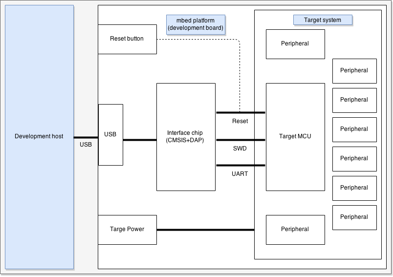
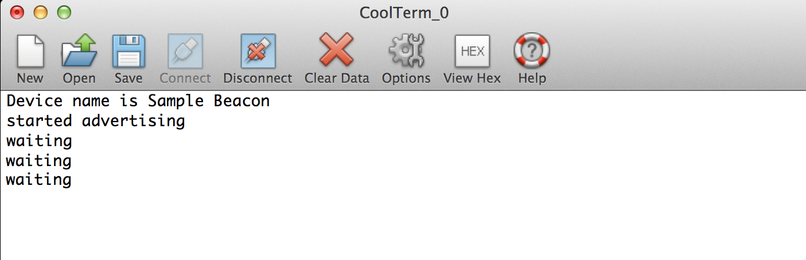

# Debugging on mbed BLE

This article reviews a few of the debugging techniques that you can use when writing applications with the BLE API on mbed boards. We'll look at using LEDs, the interface chip and third-party sniffers to debug applications.

## The quick method: LEDs

Most boards come with at least one LED that can be controlled using the standard mbed API. Turning the LED on or off, or flashing it, is a quick method of knowing that we’ve reached a certain state. For example:

1.	We can turn on an LED when the board starts up by making it the first action of ``main()``. This helps us know that our board is alive and running our program. You’ll find this function in some of the samples on our site.

1.	We can flash an LED when we enter an error handler. This tells us that we’re in trouble.

1.	We can turn on an LED when running the background activity of the program in ``main()``, for example with ``waitForEvent()``. We'll turn it off whenever an interrupt handler pre-empts ``main()``. If the LED never turns on again, it means that ``main()`` never got back control and we are trapped in the interrupt handler. For more information about handlers, see our discussion on [event driven programming](../mbed_Classic/Events.md).

LEDs require almost no coding and processing, giving them near-zero overhead. Here’s an example of creating an LED object and turning it on and off:

```c
#include <mbed.h>

DigitalOut led(LED1); // DigitalOut is part of the standard mbed API

... somewhere later ...
	/* writing 1 to an LED usually turns it on, 
	* but your board might want 0 rather than 1. */
	led = 1; 

... or perhaps in some other file ...

	extern DigitalOut led;
	led = 0;
```

### The LED error() utility

The mbed SDK includes a utility called ``error()``. It takes in printf()-style parameters, but its output is an LED pattern that is easily identified as an alert. This gives visual error indication without need to write with ``printf()`` (as we do below). It is used for runtime errors, which are errors caused by:

* Code trying to perform an invalid operation.

* Hardware that cannot be accessed because it is malfunctioning. 

<span class="tips">For more information about ``error()``, see the [handbook](http://developer.mbed.org/handbook/Debugging#runtime-errors).</span>

## Debugging with the mbed interface chip

Most mbed platforms come with an interface chip placed between the target microcontroller (in our case: the BLE microcontroller) and the development host (our computer). It is a USB bridge from the development host to the debugging capabilities available in ARM microcontrollers. This bridge functionality is encapsulated in a standard called [CMSIS-DAP](http://developer.mbed.org/handbook/CMSIS-DAP). Major toolchain vendors have started supporting this standard, so we expect it to grow in popularity and availability over time. 

<span class="notes">**Note:** some smaller boards reduce size and cost by not carrying an interface chip. If you’re using one of those boards, you can skip to the [next section](#uart).</span>

By using the interface chip we can debug with:

* ``printf()`` and its associated capabilities.

* pyOCD.

<span class="images"><span>The development host uses a USB connection with the interface chip to debug the microcontroller. Some of the terms in this image will be clarified later in the document.</span></span>

### Printf()

Programs typically use the printf() family to communicate something readable back to the user:

1. The printf() functions produce output according to a format string (containing format specifiers) and matching value arguments. 
1. The microcontroller's universal asynchronous receiver/transmitter (UART) console peripheral "feeds" output from ``printf()`` into the interface chip. 
1. The chip forwards the feed to the development host. 
1. This printf() traffic can be viewed with a terminal program running on the host. 

<span class="tips">
**Tip:** The following examples use the CoolTerm serial port application to read the ``printf()`` output, but you can use any terminal program you want and expect similar results.
</br>
**Tip:** The UART protocol requires that the sender and receiver each maintain their own clocks and know the baud rate. mbed interface chips use the 9,600 baud rate and your terminal program should be set to that baud rate to intercept the communication.
</span>

``printf()`` doesn’t come free - it exerts some costs on our program:

* An additional 5-10K of flash memory use. Do note, however, that this is the cost of the first use of ``printf()`` in a program; further uses cost almost no additional memory.

* Each call to ``printf()`` takes a significant time for processing and execution: about 100,000 instructions, or 10 milliseconds, depending on the clock speed. This is only a baseline: ``printf()`` with formatting will cost even more. If your clock runs slowly (as most microcontrollers' clocks do) and your computational power is therefore lower, ``printf()`` can sometimes cost so much it’s actually used as a delay.

These two costs require that we use ``printf()`` judiciously. First, because there is limited code-space on the microcontroller's internal flash. Second, because it delays the program so much. Be particularly careful about using it in an event handler, which we expect to terminate within a few microseconds.

<span class="notes">**Note:** ``printf()`` doesn’t require that you tell it beforehand how many parameters it should expect; it can receive any number you throw at it. To do this, you need to provide a format string with format specifiers, followed by a matching number of arguments. For example, ``printf(“temp too high %d”, temp)``: the format string is “temp too high %d”, and the format specifier is %d. The last bit is the argument: temp. It matches the format specifier %d, which specifies an integer. You can learn more on [Wikipedia](http://en.wikipedia.org/wiki/Printf_format_string).</span>

Using ``printf()`` on mbed requires including the ``stdio`` header:

```c
#include <stdio.h>

... some code ...

	printf("debug value %x\r\n", value);
```

Here's a very basic example. In the [UriBeacon program](../mbed_Classic/URIBeacon.md), we've added ``printf()`` in three places (this is too much for a real-life program):

* After setting ``DEVICE_NAME``, we've added ``printf("Device name is %s\r\n", DEVICE_NAME);``

* After ``startAdvertisingUriBeaconConfig();`` we've added ``printf("started advertising \r\n")``;.

* After ``ble.waitForEvent();`` we've added ``printf("waiting \r\n");``.

This is the terminal output. Note that "waiting" is printed every time ``waitForEvent`` is triggered:

<span class="images"></span>

### Printf() macros

There are some nifty tricks you can do with ``printf()`` using macro-replacement by the pre-processor.

The general form for a simple macro definition is:

```
#define MACRO_NAME value
```

This associates with the **MACRO_NAME** whatever **value** appears between the first space after the **MACRO_NAME** and the end of the line. The value constitutes the body of the macro.

``printf()``s are very useful for debugging when looking for an explanation to a problem. Otherwise, it is nice to be able to disable many of them. We can use the ``#define`` directive to create parameterized macros that extend the basic ``printf()`` functionality. For example, macros can expand to printf()s when needed, but to empty statements under other conditions. 

The general form for defining a parameterized macro is:

```
#define MACRO_NAME(param1, param2, ...)      
	{body-of-macro}
```

For example, it is often useful to categorise ``printf()`` statements by severity levels like ‘DEBUG’, ‘WARNING’ and ‘ERROR’. For this, we define levels of severity. Then, each time we compile or run the program, we specify which level we’d like to use. The level we specified is used by our macros in an ``if`` condition. That condition can control the format of the information the macro will print, or whether or not it will print anything at all. This gives us full control of the debug information presented to us every run.

Remember that ``printf()`` can take as many parameters as you throw at it. Macros support this functionality: they can be defined with ``...`` to mimic printf()’s behaviour. To learn more about using ``...`` in your code, read about [variadic macros on Wikipedia](http://en.wikipedia.org/wiki/Variadic_macro).

Here is an example:

```c
	-- within some header file named something like trace.h --
enum {
	TRACE_LEVEL_DEBUG,
	TRACE_LEVEL_WARNING
};
/* each time we compile or run the program, 
* we determine what the trace level is.
* this parameter is available to the macros 
* without being explicitly passed to them*/
	
extern unsigned traceLevel; 

...

// Our first macro is printed if the trace level we selected 
// is TRACE_LEVEL_DEBUG or above. 	
// The traceLevel is used in the condition                                            
// and the regular parameters are used in the action that follows the IF
#define TRACE_DEBUG(formatstring, parameter1, parameter2, ...) \
	{ if (traceLevel >= TRACE_LEVEL_DEBUG) \
			{ printf("-D- " formatstring, __VA_ARGS__); } } 
// this will include the parameters we passed above
	
// we create a different macro for each trace level
#define TRACE_WARNING(formatstring, parameter1, parameter2, ...) \
	{ if (traceLevel >= TRACE_LEVEL_WARNING) \
		{ printf("-W- " formatstring, __VA_ARGS__); } }
```

Here’s another example of macro-replacement that allows a formatted ``printf()``. Set ``#define MODULE_NAME "<YourModuleName>"`` before including the code below, and enjoy colourised ``printf()`` tagged with the module name that generated it:

```c
#define LOG(x, ...) \
	{ printf("\x1b[34m%12.12s: \x1b[39m"x"\x1b[39;49m\r\n", \
	MODULE_NAME, ##__VA_ARGS__); fflush(stdout); }
#define WARN(x, ...) \
	{ printf("\x1b[34m%12.12s: \x1b[33m"x"\x1b[39;49m\r\n", \
	MODULE_NAME, ##__VA_ARGS__); fflush(stdout); }
```

You can use ``ASSERT()`` to improve error reporting. It will use ``error()`` (a part of the mbed SDK that we reviewed earlier). ``error()`` not only flashes LEDs, it also puts the program into an infinite loop, preventing further operations. This will happen if the ``ASSERT()`` condition is evaluated as FALSE:

```c
#define ASSERT(condition, ...)	{ \
	if (!(condition))	{ \
		error("Assert: " __VA_ARGS__); \
	} }
```

### Fast circular log buffers based on printf()

When trying to capture logs from events that occur in rapid succession, using ``printf()`` may introduce unacceptable run-time latencies, which might alter the system's behaviour or destabilise it. But delays in ``printf()`` aren’t because of the cost of generating the messages. The biggest cause of delay with ``printf()`` is actually pushing the logs to the UART. So the obvious solution is not to avoid ``printf()``, but to avoid pushing the logs to the UART while the operation we're debugging is running.

To avoid pushing during the operation’s run, we use ``sprintf()`` to write the log messages into a ring buffer (we’ll explain what that is in the next paragraph). The buffer holds the debugging messages in memory until the system is idle. Only then will we perform the costly action of sending the information through the UART. In BLE, the system usually idles in ``main()`` while waiting for events, so we’ll use ``main()`` to transmit.

``sprintf()`` assumes a sequential buffer into which to write - it doesn’t wrap strings around the end of the available memory. That means we have to prevent overflows ourselves. We can do this by deciding that we only append to the tail of the ring buffer if the buffer is at least half empty. In other words, so long as the information already held by the buffer doesn’t exceed the half-way mark, we will add new information "behind" it. When we reach the half-way point, we wrap-around the excess information to the beginning (rather than the tail) of the buffer, creating the “ring” of a ring buffer. Half is an arbitrary decision; you can decide to let the buffer get three-quarters full or only a tenth full.

Here is an example implementation of a ring buffer. We’ve created our own version of a wrapping ``printf()`` using a macro called ``xprintf()``.  Debug messages accumulated using ``xprintf()`` can be read out circularly starting from ``ringBufferTail`` and wrapping around (``ringBufferTail`` + ``HALF_BUFFER_SIZE``). The first message would most likely be garbled because of an overwrite by the most recently appended message:

```c
#define BUFFER_SIZE 512 /* You need to choose a suitable value here. */
#define HALF_BUFFER_SIZE (BUFFER_SIZE >> 1)

/* Here's one way of allocating the ring buffer. */
char ringBuffer[BUFFER_SIZE]; 
char *ringBufferStart = ringBuffer;
char *ringBufferTail  = ringBuffer;

void xprintf(const char *format, ...)
{
	va_list args;
	va_start(args, format);
	size_t largestWritePossible = BUFFER_SIZE - (ringBufferTail - ringBufferStart);
	int    written = vsnprintf(ringBufferTail, largestWritePossible, format, args);
	va_end(args);

	if (written < 0) {
		/* do some error handling */
		return;
	}

	/*
	* vsnprintf() doesn't write more than 'largestWritePossible' bytes to the
	* ring buffer (including the terminating null byte '\0'). If the output is
	* truncated due to this limit, then the return value ('written') is the
	* number of characters (excluding the terminating null byte) which would
	* have been written to the final string if enough space had been available.
	*/

	if (written > largestWritePossible) {
		/* There are no easy solutions to tackle this. It may be easiest to enlarge
		* your BUFFER_SIZE to avoid this. */
		return; /* this is a poor short-cut; you may want to do something else.*/
	}

	ringBufferTail += written;

	/* Is it time to wrap around? */
	if (ringBufferTail > (ringBufferStart + HALF_BUFFER_SIZE)) {
		size_t overflow = ringBufferTail - (ringBufferStart + HALF_BUFFER_SIZE);
		memmove(ringBufferStart, ringBufferStart + HALF_BUFFER_SIZE, overflow);
		ringBufferTail = ringBufferStart + overflow;
	}
}
```

### pyOCD-based debugging (GDB server)

<span class="notes">**Note:** using GDB (or any other debugger) to connect to the GDB server is useful only if we have access to the program symbols and their addresses. This is currently *not* exported when building ``.hex`` files using the mbed online IDE. We therefore need to export our project to an offline toolchain to be able to generate either an ``.elf`` file that holds symbols alongside the program, or a ``.map`` file for symbols. In the following section, we're assuming an ``.elf`` file.</span>

So far, we've connected the interface chip and the target microcontroller using UART. But there is another connection between the two: serial wire debug (SWD). This protocol offers debugging capabilities for stack trace analysis, register dumps and inspection of program execution (breakpoints, watchpoints etc). When combined with a source-level debugger on the development host, such as the GNU Project Debugger (GDB), SWD offers a very rich debugging experience - much more powerful than ``printf()``. 

<span class="tips">**Tip:** GDB is often "too rich" - don't forget the fast efficiency of ``printf()`` and the LEDs.</span>

The interface chip implements CMSIS-DAP. To drive the CMSIS-DAP interface chip over USB, you'll need to install the [pyOCD Python library](https://github.com/mbedmicro/pyOCD) on the development host.

<span class="images"></span>

<span class="tips">To install pyOCD, follow the [instructions](https://github.com/mbedmicro/pyOCD#installationn) to get the external USB libraries pyOCD relies on.
<br /><br />
**Notes:**
<br />
* You'll need to run ``setup.py`` for both the USB libraries and pyOCD. 
<br />
* You can follow [HOW_TO_BUILD.md](https://github.com/mbedmicro/pyOCD/blob/master/HOW_TO_BUILD.md) to see how to build pyOCD into a single executable GDB server program.
<br />
* A series of tests in the [test sub-folder](https://github.com/mbedmicro/pyOCD/tree/master/test) offers scripts that you may find useful as a foundation for developing custom interaction with the targets over CMSIS-DAP.</span>

The GDB server can be launched by running ``gdb_server.py``. This script should be able to detect any connected mbed boards. Here is an example of executing the script from the terminal while a Nordic mKIT is connected:

```
$ sudo python test/gdb_server.py
Welcome to the PyOCD GDB Server Beta Version
INFO:root:new board id detected: 107002001FE6E019E2190F91
id => usbinfo | boardname
0 =>   (0xd28, 0x204) [nrf51822]
INFO:root:DAP SWD MODE initialised
INFO:root:IDCODE: 0xBB11477
INFO:root:4 hardware breakpoints, 0 literal comparators
INFO:root:CPU core is Cortex-M0
INFO:root:2 hardware watchpoints
INFO:root:GDB server started at port:3333
```

At this point, the target microcontroller is waiting for interaction from a GDB server. This server is running at port 3333 on the development host. You can connect to it from a debugger such as GDB (the client).

Here is an example of launching the GDB client:

```
~/play/demo-apps/BLE_Beacon/Build$ arm-none-eabi-gdb BLE_BEACON.elf
GNU gdb (GNU Tools for ARM Embedded Processors) 7.6.0.20140731-cvs
Copyright (C) 2013 Free Software Foundation, Inc.
License GPLv3+: GNU GPL version 3 or later <http://gnu.org/licenses/gpl.html>
This is free software: you are free to change and redistribute it.
There is NO WARRANTY, to the extent permitted by law.  Type "show copying"
and "show warranty" for details.
This GDB was configured as "--host=x86_64-unknown-linux-gnu 
	--target=arm-none-eabi".
For bug reporting instructions, please see:
<http://www.gnu.org/software/gdb/bugs/>...
Reading symbols from 
	/home/rgrover/play/demo-apps/BLE_Beacon/Build/BLE_BEACON.elf...
warning: Loadable section "RW_IRAM1" outside of ELF segments
(gdb)
```

Notice that we pass the .``elf`` file as an argument. We could also have used the ``file`` command within GDB to load symbols from this ``.elf`` file after starting GDB. The command set offered by GDB to help with symbol management and debugging is outside the scope of this document, but you can find it in [GDB's documentation](https://www.gnu.org/software/gdb/documentation/).

Now, we connect to the GDB server (for ease of reading, we've added line breaks in the path);

```
(gdb) target remote localhost:3333
Remote debugging using localhost:3333
warning: Loadable section "RW_IRAM1" outside of ELF segments
HardFault_Handler () at 	/home/rgrover/play/mbed-src/libraries
		/mbed/targets/cmsis/TARGET_NORDIC/TARGET_MCU_NRF51822
		/TOOLCHAIN_ARM_STD/TARGET_MCU_NORDIC_16K
		//startup_nRF51822.s:115
115                 B       .
(gdb)
```

Now we can perform normal debugging using the GDB command console (or a GUI, if our heart desires).

<a name=”uart”>
## The UART service
</a>

BLE has a UART service that allows debugging over the BLE connection (by forwarding the output over BLE), rather than through the interface chip.

<span class="notes">**Note:** you'll need an app that can receive the service's output (the logs). There are many of these; you could try [Nordic's nRF UART](http://www.nordicsemi.com/eng/Products/nRFready-Demo-Apps/nRF-UART-App).</span>

To be able to use the UART service, your app needs:

```c
#include “UARTService.h”

...

uart = new UARTService(ble);

... and somewhat later ...

uart->writeString("some updated\r\n");
```

Note that:

* We use ``writeString()``, not ``printf()``. ``writeString()`` is defined in the ``UARTService.h`` header and calculates the string’s length for us.

* We have to prepare the output message.

* Currently you can only have one BLE connection to the device at any one time, and the UART app used for debugging takes up that connection. For example, if you're monitoring a heart rate device and receiving output over the nRF UART app, you cannot simultaneously connect to the heart rate device with a standard heart rate app.

## Sniffers

Third-party sniffers can intercept the BLE communication itself and show us what's being sent (and how). For example, we could see if our [connection parameters](../Introduction/ConnectionParameters.md) are being honoured. 

Sniffing radio activity can now be done with smart phone apps like [Bluetooth HCI Logger (for Android)](https://play.google.com/store/apps/details?id=com.android_rsap.logger&hl=en). These generate logs that can be analysed with tools like [Wireshark](https://www.wireshark.org/).

<span class="tips">
**Tip:** to learn about the Android Bluetooth HCI snoop log, start [here](http://www.androidcentral.com/all-about-your-phones-developer-options).
</span>

If you want to use a separate BLE device (not your phone) to sniff the BLE traffic, you can try [Nordic's nRF Sniffer](https://www.nordicsemi.com/eng/Products/Bluetooth-Smart-Bluetooth-low-energy/nRF-Sniffer) on a Nordic BLE board.

## Further reading

For more information about debugging mbed OS, see [the handbook](https://docs.mbed.com/docs/mbed-os-handbook/en/latest/debugging/debugging/).