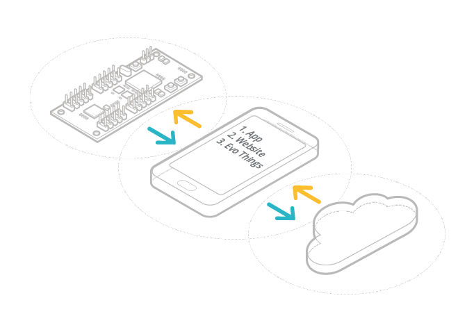

#mbed BLE for Developers

This document is written for experienced BLE developers who are switching to mbed platforms. If you feel that you need more information than this document provides, please refer to our [extended documentation](../Introduction/BeginnersIntro.md).

##BLE on mbed

[mbed](http://developer.mbed.org) gives you three things: a well defined hardware platform, APIs to abstract this platform (including some specifically for BLE) and an online compiler integrated with these tools:

1. Some platforms require an external [BLE component](http://developer.mbed.org/components/cat/bluetooth/), and [some](http://developer.mbed.org/platforms/mbed-HRM1017/) [have it](http://developer.mbed.org/platforms/RedBearLab-BLE-Nano/) [built-in](http://developer.mbed.org/platforms/Nordic-nRF51-Dongle/).

2. mbed has a BLE-specific API ([BLE_API](http://developer.mbed.org/teams/Bluetooth-Low-Energy/code/BLE_API/file/1956023d42fb/README.md)), a high level abstraction for using BLE on multiple platforms.
	
3. The mbed BLE tools are written in C++ and can be used from the online [mbed compiler](https://developer.mbed.org/compiler/) or offline, for example with [GCC](http://developer.mbed.org/forum/team-63-Bluetooth-Low-Energy-community/topic/5257/).

BLE is most useful when used with a website or app on your mobile or tablet. See the next section for options.

A BLE device currently requires an app or website running on a phone

___

##Rapid Prototyping

mbed comes from a heritage of rapid prototyping and allows you to test code and ideas on BLE devices very easily. 

For information about rapid prototyping with mbed BLE, see [here](../Advanced/Prototyping.md).

___

##BLE in Depth

If you want more information about how BLE works, see our [BLE in Depth document](../Introduction/BLEInDepth.md). 

___

##Quick Samples

**Tip:** The quick samples are written for experienced BLE developers with an understanding of the mbed IDE. If you want more information about the IDE, see the [tutorials](../mbed_Classic/IntroSamples.md), which offer extended versions of the same samples. 

The samples cover:

1. A [URI Beacon](#uribeaconsample).
	
2. A [heart rate monitor](#hearratesample).
	
3. [Service creation](../Advanced/Overview.md): for a read-only characteristic and for a read/write characteristic.

____

<a name="uribeaconsample">
###Quick Sample One: URI Beacon
</a>

**Tip:** If you don’t know how to register your board, or how to work with the mbed compiler, please see the [extended URI Beacon tutorial](../mbed_Classic/URIBeacon.md). 

You might want to start with a short [video](https://www.youtube.com/watch?v=vZ-_fZlV2-w&feature=youtu.be).

To get this sample working, you'll need:

+ To see BLE devices and their advertisement or beacon information, get *one* of the following installed on your phone: 

	-  The physical web app. You can get that app for [iOS](https://itunes.apple.com/us/app/physical-web/id927653608?mt=8) and for 
[Android](https://play.google.com/store/apps/details?id=physical_web.org.physicalweb).

	- For Android, you can get [nRF Master Control Panel](https://play.google.com/store/apps/detailsid=no.nordicsemi.android.mcp&hl=en).

	- For iPhone, you can get [LightBlue](https://itunes.apple.com/gb/app/lightblue-bluetooth-low-energy/id557428110?mt=8).

+ A BLE-enabled mbed board.

**Note:** if your board appears as JLINK instead of mbed, please go to the [platform page](http://developer.mbed.org/platforms/) for your board and follow the firmware update instructions.

+ A user on [developer.mbed.org](developer.mbed.org) to access the compiler.

If you’re familiar with mbed and our compiler, you can get the beacon working in just a few minutes:

1. Open the compiler and select or add your board.

2. Import the [``BLE_URIBeacon``](http://developer.mbed.org/teams/Bluetooth-Low-Energy/code/BLE_URIBeacon/) program.

3. In ``main.cpp``, find the line   ``nrfURIBeaconConfigService uriBeaconConfig(ble,``   ``params, !fetchedFromPersistentStorage,``  ``"http://www.uribeacon.org", defaultAdvPowerLevels);``  and edit the URL. Note that it's limited to 18 characters, with “http://www.” (or “http://”, if there’s no “www” ) counting as one, and the suffix “.org” (or “.com”) counting as another.

5. Compile the code. It will be downloaded to your Downloads folder (on some browsers you may need to specify a download location).

6. Drag and drop the compiled file to your board as the target platform.

7. Restart the board.

7. On the app you installed on your phone, discover your beacon and check that the URL is correct.
 
**Note:** the URIBeacon goes into [configuration mode](../Advanced/URIBeaconAdv.md) for the first 60 seconds after it's turned on. It will appear with your information when that minute is up.

You might be interested in some of the URI Beacon's [advanced features](../Advanced/URIBeaconAdv.md).
____

<a name="hearratesample">
###Quick Sample Two: Heart Rate
</a>

**Tip:** If you don’t know how to register your board, or how to work with the mbed compiler, please see the [extended URI Beacon tutorial](../mbed_Classic/URIBeacon.md). 

To see the heart rate information on your phone, download PanoBike for [iOS](https://itunes.apple.com/gb/app/panobike/id567403997?mt=8) or [Android](https://play.google.com/store/apps/details?id=com.topeak.panobike&hl=en). Then:

1. Open the compiler and select or add your board as the target platform.

2. Import the [``heart rate service``](http://developer.mbed.org/teams/Bluetooth-Low-Energy/code/BLE_HeartRate/).

3. In ``main.cpp``, find the line ``const static char DEVICE_NAME[] = "HRM1";`` and change the beacon's name from HRM1. 

4. Compile the code. It will be downloaded to your Downloads folder (on some browsers you may need to specify a download location).

5. Drag and drop the compiled file to your board.

6. Restart the board.

6. On the PanoBike application, watch the heart rate. It should go from 100 to 175 in increments of one, then reset.

____

For service creation, see our [advanced samples](../Advanced/Overview.md).

______
Copyright © 2015 ARM Ltd. All rights reserved.
