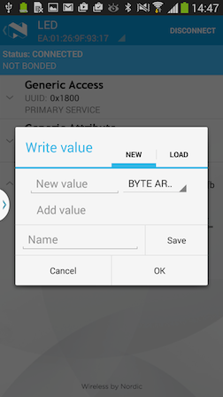

#Rapid prototyping on mbed BLE

mbed comes from a heritage of rapid prototyping and allows you to test code and ideas on BLE devices very easily. For a truly awesome BLE experience, however, you'll need to pair mbed with tools for rapidly prototyping the app side of your solution. This article reviews tools that you might find useful in the early stages of development:

* Feed user interaction directly to the BLE device using [hardware inputs](#hardware), for example a touchscreen.

* Create simple apps on [Evothings Studio](http://www.evothings.com) and run them on the Evothings App on your phone. It requires some learning of its own, but it [may well be worth your time](#evothings).

* Use [generic BLE apps](#apps) to see information sent from the device and send simple commands. 

* Use debugging techniques as a simple first step before prototyping: [the mbed interface chip](#chip), the [UART service](#uart) and [third-party sniffers](#sniffers).

Once your prototype works as you wanted, you can invest some more time in your user input, including creating full-fledged apps. 

**Tip:** If you want to be part of the Physical Web stick to a website, use the BLE device only to advertise the site's URL.

<a name="hardware">
##Hardware inputs
</a>

mbed supports a wide range of components, and many of them can be used to prototype user interaction. For example, [touch screens](http://developer.mbed.org/components/cat/display/), [wireless controllers](http://developer.mbed.org/components/cat/robotics/) or the buttons on the mbed board itself can be used for simple inputs.

<a name="evothings">
##Evothings
</a>

[Evothings](http://evothings.com/) isn’t an mbed tool, but since it’s designed for the Internet of Things it works quite well with our BLE-enabled boards. It gives you the Evothings Studio on which to build your prototyping app, and an enveloping Evothings App that lets you run the app you built on your smartphone without custom-building it for each OS. You’ll see Evothings from time to time in our own samples, such as the [custom GAPP service sample](../Advanced/GATTEvo.md).

<a name="apps">
##Generic BLE apps
</a>

You can use a generic BLE app to see information sent by your device. In our samples we often use one of the following:

* For Android: [nRF Master Control Panel](https://play.google.com/store/apps/detailsid=no.nordicsemi.android.mcp&hl=en).

* For iPhone: [LightBlue](https://itunes.apple.com/gb/app/lightblue-bluetooth-low-energy/id557428110?mt=8).

These apps scan for nearby BLE devices and display the information received from their advertising mode. They can also establish a connection (connected mode), receive notifications and send user input to the device. You can see an example of this in our [actuator service template](../Advanced/LEDReadWrite.md#controlling-the-led), where we use the nRF Master Control Panel to send a new value to a read/write characteristic:

##Debugging techniques

Debugging isn’t a prototyping technique, but since you can use it to show that your code works, it can be used as a first step or even as a proof of concept.

<a name="chip">
###Using the mbed interface chip
</a>

You can use the mbed Interface Chip to receive messages from either ``printf()`` or ``pyOCD``. These are reviewed as part of our [debugging with the interface chip section](../Advanced/Debugging.md#debugging-with-the-mbed-interface-chip).

<a name="uart">
###Using the UART service
</a>

The UART Service can be used to debug directly over the BLE connection (with the aid of an app). For more information, see our [debugging with the UART service section](../Advanced/Debugging.md#the-uart-service). 

<a name="sniffers">
###Third-party sniffers
</a>

Third party sniffers can intercept BLE communication on your phone or on dedicated hardware. For more information, see our [debugging with sniffers section](../Advanced/Debugging.md#sniffers).
