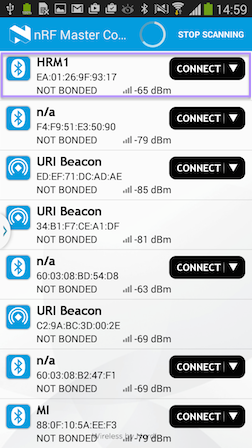
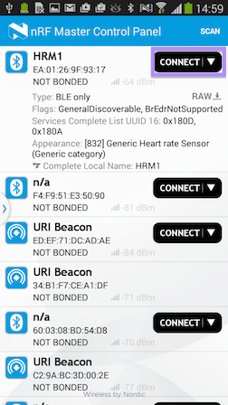
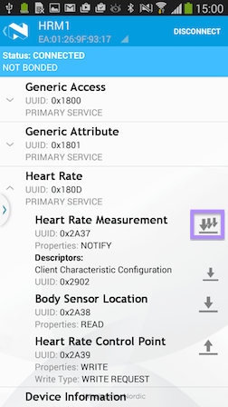
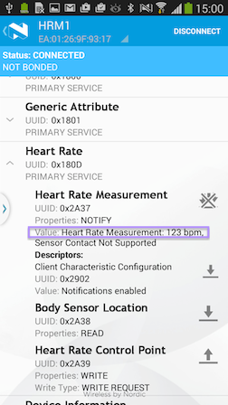

# Tutorial 2: heart rate monitor (BLE services)


The heart rate service gathers the heart rate reading from a monitor and sends it to an app. This app must be capable of working with the heart rate profile. Both the profile and the service are predefined and [publicly available](https://developer.bluetooth.org/TechnologyOverview/Pages/HRP.aspx). That means that if you want to get a heart rate monitor's input to your phone, you don't have to write your own code.

This tutorial covers a lot, and you may need to read it more than once:

1. If you just want to get the heart rate monitor up and running, take a look at the [requirements list ](#what-you-need) and then go to the [quick guide](#quick-guide).

2. If you want a deeper understanding of the code, go to [Understanding the Heart Rate Service](#understanding). It covers [objects](#objects), [loops](#loops), [parameters](#parameters), [conditions](#conditions) and [events](#eventdriven).

## What you need


1. An account on [mbed.org](https://developer.mbed.org/account/signup/?next=%2F)

1. If you don't already know how to import your board and a program into the compiler, please see the [mbed OS handbook](https://docs.mbed.com/docs/mbed-os-handbook/en/latest/getting_started/blinky_compiler/).

1. To see the heart rate information on your phone, download Panobike for [iOS](https://itunes.apple.com/gb/app/panobike/id567403997?mt=8) or [Android](https://play.google.com/store/apps/details?id=com.topeak.panobike&hl=en).

## Quick guide

If you're familiar with mbed and our compiler, you can get the heart rate monitor working in just a few minutes:

1. Open the compiler and select or add your board as the target platform.

2. Import the [``heart rate service``](http://developer.mbed.org/teams/Bluetooth-Low-Energy/code/BLE_HeartRate/).

3. In ``main.cpp``, find the line ``const static char DEVICE_NAME[] = "HRM1";`` and change the beacon's name from HRM1 to a name of your choosing. 

4. Compile the code. It will be downloaded to your Downloads folder (on some browsers you may need to specify a download location). 

	**Note:** make sure you've selected the correct platform as the compilation target. The platform is shown as an icon on the right-hand top corner of the compiler. If you're seeing the wrong platform, click the icon to open the Select Platform window.

5. Drag and drop the compiled file to your board.

6. Restart the board.

6. On the PanoBike application, watch the heart rate. It should go from 100 to 175 in increments of one, then reset.
____

## Understanding the heart rate service


<span class="notes">**Note:** If you don't want to get too deeply into the code - skip [ahead](#renaming-your-beacon).</span>

The Heart Rate Service and the Device Information Service together form the Heart Rate Profile. It connects a heart rate monitor to an app that requires its input, for example a fitness app.

The service has [three characteristics](https://developer.bluetooth.org/TechnologyOverview/Pages/HRS.aspx):

* **Heart Rate Measurement**: sends the heart rate to the app.

* **Body Sensor Location**: describes where on the body to put the sensor.

* **Heart Rate Control Point**: receives a value from the user when the user wants to reset the *Energy Expanded* measurement.

It is important to understand that this demo fakes a heart rate value; it does not interact with a physical heart rate sensor to fetch real data. To work with a real heart rate application, we would have had to create a very specific example, which would have been harder to learn from. You should be able to modify the general demo to fit any app that you want to work with if you have a real heart rate sensor. Please check [mbed.org](http://developer.mbed.org) before you start working - there may already be code available for your heart rate sensor.

## Understanding the code

The code we generated for this sample may seem long and complex, but when we break it down to components, it becomes clear that the heart rate portion is quite simple.

<a name=”objects”>
### Setting up the service (creating an instance of the object)
</a>

We start with setting up the service:

```c
// Set up primary service.
uint8_t hrmCounter = 100;
HeartRateService hrService(ble, 
	hrmCounter, HeartRateService::LOCATION_FINGER);
```

The first line is only a comment, telling us the general purpose of this section. 

The second line sets up a fake heart rate for the purpose of this sample:

```c
uint8_t hrmCounter = 100;
```

It's a parameter that we call ``hrmCounter``, and we give it an initial value of 100 (in the context we'll be using it, it means 100 heart beats per minute). Because we're programming in C++, we used ``uint8_t`` to indicate to the compiler that the parameter ``hrmCounter`` is of a type called **unsigned integer**, and its length is 8 bits. We won't get into what that means now, but there's plenty of information on line if you're interested in parameter types.

The third line of code is more interesting, as in it we set up the full service. Let's take a closer look at it:

```c
HeartRateService hrService(ble, 
	hrmCounter, HeartRateService::LOCATION_FINGER);
```

To get the heart rate measurement we want, we need to create an instance of a type called ``HeartRateService``. This is an object that's defined as part of ``BLE_API``, so you can find its ``.h`` file in your compiler by going to ``BLE_HeartRate > BLE_API > services > HeartRateService.h``. You don't need to look at that file if you don't want to, but you might find it interesting.

When we create the instance of a type, we first give it a name (in this case ``hrService``), and then provide it with information it needs to be set up correctly:

1. ``ble`` - this is a reference to the fact that we're using a BLE device. 

2. ``hrmCounter`` - the initial value of the counter. We defined this as 100 in the previous line. It could just as easily have been another value, and if we had a sensor it would have been the initial measurement from that sensor. d

3. ``HeartRateService::LOCATION_FINGER`` - where on the body to attach the sensor. The ``HeartRateService.h`` has a list of locations, and we've selected the finger.

<span class="tips">**Tip:** The information an object requires to be initialised correctly is part of the overall definition of the object, and in this case can be found in the ``HeartRateService.h`` file.</span>

<a name=”loops”>
### Using the service (WHILE and IF loops)
</a>

#### Objects and functions

Once we create an instance of a type by giving it a name and its initial parameters, we can start using it. Objects have functions that are defined along with them (they're part of the type's blueprint), and can be accessed from every instance of an object. In this case, the functions are all in the ``HeartRateService.h`` file that we used to create the object.

This is what we do with the ``hrService`` object:

```c
while (true) {
	if (triggerSensorPolling && ble.getGapState().connected) {
		triggerSensorPolling = false;

		/* Do blocking calls or whatever is necessary for sensor polling. */
		/* In our case, we simply update the dummy HRM measurement. */

		hrmCounter++;
		if (hrmCounter == 175) {
			hrmCounter = 100;
		}

		hrService.updateHeartRate(hrmCounter);
	} else {
		ble.waitForEvent();
	}
```

Let's break that down.

#### WHILE

Before saying what the program should do (the function), we tell it when to do it. We use two tools to determine this: 

* A condition that determines when to start the function, for example "when you get a new value from the thermometer". 

* A definition of how many times to run when the starting condition is met. We can tell a function to run once, twice, to infinity or until the condition suddenly fails.

In this example, we use the condition both to determine when to start running and to determine when to stop. To do this:

* We created a WHILE loop, which is a way of saying "start this function when this condition is met, and don't stop until the condition is false". 

* We said that the condition is that the value of ``triggerSensorPolling`` is TRUE rather than FALSE. That value is determined inside the loop. 

If the value of ``triggerSensorPolling`` becomes FALSE, the condition will fail and the function won't run any more. This is called "exiting the loop".

The condition we're checking for this loop has two parts:

```c
	if (triggerSensorPolling && ble.getGapState().connected)
```

1. ``triggerSensorPolling``: checks whether we need to read a new value from heart-rate sensor. This condition is set to TRUE periodically (see [below](#eventdriven)). 

2. ``ble.getGapState().connected``: checks whether a GAP connection exists between our peripheral device and a central device. We do this because we don't want to poll for sensor data unless there is an active connection. Without an active connection we can't get any data, so we should save our battery.
``ble.getGapState()`` by itself returns a collection of status data about the GAP connection. We're interested only in the boolean status of the connection: connected is TRUE and disconnected is FALSE. This member is extracted from the collection by the expression ``ble.getGapState().connected``, and the value is then used to evaluate the condition for the if statement.
 
For the condition as a whole to be considered true, both of its parts (trigger to read a new value and connection status) must be true. In other words, the loop will not run if it’s not time to read information from the sensor, or if the GAP status is not "connected". 

<a name=”parameters”>
#### Manipulating parameters - increments
</a>

While the loop is running, it updates the heart rate reading it sends our fitness app. Since we're faking a sensor, our code supplies fake values:

```c
hrmCounter++;
```

C++ has several shorthands it uses for common mathematical actions. When we see ``hrmCounter++``, it means that ``hrmCounter``'s value grows by 1. It's the same as saying ``hrmCounter = hrmCounter + 1``. This is called an *increment operator*.

`hrmCounter`` starts with a value of 100, because that's the value we gave it when we set up our service earlier. Every time the loop runs we take the current value of ``hrmCounter`` and add 1. So our app will show 100, 101, 102, 103...

<a name=”conditions”>
#### IF
</a>

But we don't want the heart rate to grow indefinitely, so we created a condition:

```c
if (hrmCounter == 175) {
	hrmCounter = 100;
}
hrService.updateHeartRate(hrmCounter);
```

Every time we're done adding 1 to our heart rate (every time we run the loop), we check its new value. When it reaches 175, we change it to 100 and start counting to 175 again. 

Note that we use two equal signs (==) to check the condition, not one. This is because we're checking if ``hrmCounter`` equals 175, not giving it the value 175. If we were to write ``hrmCounter = 175``, we'd be *assigning* the value to the parameter. We did that earlier in the code, when we gave the parameter its initial value of 100, and we do it again in the very next line, when we once again assign 100 as its value.

Note also that the IF is *nested* in the WHILE loop. That means it doesn't wait for the WHILE loop to finish running, but rather runs as part of it.

####Updating objects

When we determine what the heart rate is (our incremented value or back to 100), we set that as the value of the heart rate in the service. We called our instance of the service ``hrService`` earlier, so that's what we call it now. As an object of type ``HeartRateService``, it has a function called ``updateHeartRate`` (defined in the ``HeartRateService.h`` file). That function can accept as an input our ``hrmCounter`` parameter. So, let's say the current value of ``hrmCounter`` is 83. We say:

```c
hrService.updateHeartRate(hrmCounter);
```

Which means, in plain English, "tell the object *hrService* to use its function *updateHeartRate*; that function will update the object's heart rate value to *hrmCounter's* value".

<a name="eventdriven">
#### Event-driven programming
</a>

mbed programming is event-driven. In normal programming logic is expressed in small functions that get executed sequentially. In event-driven programming we break away from the sequence and move to *event handlers*. These are bits of code that get invoked by the operating system (mbed OS) in response to system interrupts or other events. In the world of electronics, interrupts come from the hardware: they are generated by changes in electrical signals or system activity (such as radio communication). In other words, event-driven programming means writing code to execute in response to interrupts. 

Code in embedded applications is executed in two contexts:

1. A main loop - ``main()``. This loop forms the background activity of an application and sends the application into a deep sleep whenever no action is needed.

2. One or more event handlers, which respond to asynchronous system activities (activities whose timing is not predetermined). In the context of BLE, event handlers may be triggered quite regularly, for example if a sensor sends a measurement every x seconds, or they may be triggered at no particular interval.

Event handlers are often preemptive, meaning they can interrupt the main program’s execution to force their own execution. The main program will only resume when the interrupting event is fully handled. In the case of BLE, we expect the main program to be a sleep loop (``waitForEvent``). This way the device will sleep unless it receives an interrupt - which is why BLE is a low energy technology.

<span class="images"><span>An event interrupts the main loop and triggers an event handler. The interrupt is handled, and the event handler then returns control to main()</span></span>

The relationship between ``main()`` and event handlers is all about timing, especially the decision about which code to move to an event handler and which to leave in ``main()``. Handler execution time is often not determined by the size of the code. It can instead be determined by how many times it must run - for example, how many iterations of a data-processing loop it performs. It can also be determined by communication with external components such as sensors (also called *polling*). Communication delays can range from a few microseconds to milliseconds, depending on the sensor involved. Reading an accelerometer can take around a millisecond, and a temperature sensor can take up to a few hundred microseconds. A barometer, on the other hand, can take up to 10 milliseconds to yield a new sensor value. 

An event, such as a sensor reading, wants to trigger an event handler that will wake the device and run immediately. This can happen if the event arrives when the program is in ``main()`` (when the device is sleeping, in our case). But if the event arrives when an event handler is being executed, it may have to wait for the first event to be handled in full. In this scenario, the first event is blocking the execution of the second event. Because event handlers can block each other, they are supposed to execute quickly and then return control to ``main()``. The quick return to ``main()`` allows the system to remain responsive. In the world of microcontrollers, anything longer than a few dozen microseconds is too long. A millisecond is an eternity. Therefore, activities longer than 100 microseconds, such as data processing and sensor communication, should be put in ``main()`` and not in an event handler. This allows event handlers to interrupt long-running processes, meaning the system remains responsive while running these processes. 

In these cases, the event handler is used not to perform functions but rather to enqueue work for the main loop. In the [heart rate demo](http://developer.mbed.org/teams/Bluetooth-Low-Energy/code/BLE_HeartRate/), the work of polling for heart rate data is communicated to the main loop through the variable ``triggerSensorPolling``, which gets set periodically from an event handler called ``periodicCallback()``. 

#### Waiting for events

The last bit of the WHILE loop is the ELSE section. ELSE tells the program what to do if the condition of the WHILE loop isn't met. Remember that our condition was to have a sensor that's providing information and an active GAP connection. If the program sees that we don't have one or the other of these, it will enter the ELSE clause. 

```c
ble.waitForEvent();
```

When we created our object we said that it's a BLE device, and that gave it the ability to use the function ``waitForEvent`` that belongs to ``BLE_API``. ``waitForEvent`` lets the device sleep until something is needed of it. This reduces battery usage. When an event occurs, for example when the heart rate monitor starts sending values (which is a condition of the WHILE loop), the device will wake up and update the value in the service. 

## Recap: the heart rate service

To summarise, this is how we used the Heart Rate service:

1. ``BLE_API`` gives us a .h file called ``HeartRateService``, which holds all the code we need to correctly set up a service object.

2. In our ``main.cpp`` file, we created an object of type ``HeartRateService``, and called it ``hrService``.

3. To correctly initialise the object, we gave it three parameters, one of which is an initial heart rate value. We called the parameter holding that value ``hrmCounter`` and gave it the value 100.

4. We decided that the object will be used periodically, rather than constantly. So we set a condition that it should only be used when it is time to poll the physical sensor for new information, and only if there is a GAP connection between the BLE device and a client.

5. Then we created a heart rate value to give the object. In a normal service, this value will be provided by the heart rate sensor. Because we're not using a sensor, we created a fake value that is a one-step increment from the previous value. We reset the value to 100 every time it reaches 175.

6. When we have our value, we update the service by using the object's built-in update function: ``hrService.updateHeartRate(hrmCounter)``.

7. Lastly, we said that if we can't meet the conditions set up in step #4, we'll let the device sleep until it receives an event, at which point it will check the condition again. 

## Renaming your beacon

Your device's name is part of the advertisement information, and you can (and should) change it from a standard name to something you'll easily recognise. 

To rename your beacon, find the following line of code in the ``main.cpp`` file:

```c
const static char DEVICE_NAME[] = "HRM1";
```

The default name is "HRM1". You can change it to anything you like (but stay under 18 characters). Don't forget to leave it in quotes:

```c
const static char DEVICE_NAME[] = "I_Renamed_This";
```

<span class="tips">**Tip**: iOS "sticks" to the name it first discovers for each beacon, so whatever name you choose now you'll have for a while. This is called *caching*, and is intended to save your phone some time and energy.</span>


## Viewing the service details

Panobike and other fitness apps show you the heart rate, but you can use [nRF Master Control Panel](http://www.nordicsemi.com/eng/Products/nRFready-Demo-APPS/nRF-Master-Control-Panel-for-Android-4.3), [LightBlue](https://itunes.apple.com/gb/app/lightblue-bluetooth-low-energy/id557428110?mt=8) and similar products to see more details.

Here is our app, discovered on nRF:

<span class="images"></soan>

By clicking the HRM entry, we can see some more information about it:

<span class="images"></span>

We can click **Connect** to see the full details:

<span class="images"></span>

If we click the **notifications** button, we'll be asking the service to notify our device of updates. In our case, that will be new heart rate values:

<span class="images"></span>

The server will notify our phone with each new value:

<span class="images"></span>

And that's it!
